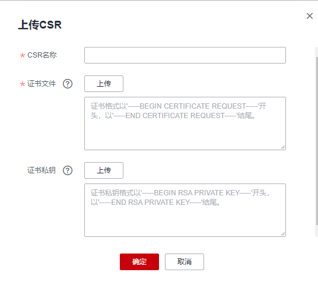

# 上传CSR

如您在申请证书时需要使用未在云证书管理服务控制台创建的CSR，可参考本章节上传已有的CSR，并对其进行统一管理。

## 操作步骤

1.  登录[管理控制台](https://console.huaweicloud.com/)。
2.  单击页面左上方的，选择“安全与合规  \>  云证书管理服务“，进入云证书管理界面。
3.  在左侧导航栏选择“SSL证书管理 \>SSL证书证书列表 \> CSR管理“，进入CSR管理界面。
4.  单击“上传CSR“。
5.  在弹出页面单击上传，分别上传证书文件和证书私钥，如[图 上传CSR](#fig126205271517)。

    **图 1**  上传CSR  
    

    **表 1**  参数说明

    
    <table><thead align="left"><tr id="row6814202221710"><th class="cellrowborder" valign="top" width="50%" id="mcps1.2.3.1.1">
参数名称

    </th>
    <th class="cellrowborder" valign="top" width="50%" id="mcps1.2.3.1.2">
参数说明

    </th>
    </tr>
    </thead>
    <tbody><tr id="row178156226178"><td class="cellrowborder" valign="top" width="50%" headers="mcps1.2.3.1.1 ">
CSR名称

    </td>
    <td class="cellrowborder" valign="top" width="50%" headers="mcps1.2.3.1.2 ">
为创建的CSR自定义一个名称。

    
支持使用英文大小写字母（a~z和A~Z）、阿拉伯数字（0~9）、下划线（_）、短划线（-）。长度不超过50个字符。

    </td>
    </tr>
    <tr id="row1881562271717"><td class="cellrowborder" valign="top" width="50%" headers="mcps1.2.3.1.1 ">
证书文件

    </td>
    <td class="cellrowborder" valign="top" width="50%" headers="mcps1.2.3.1.2 ">
上传目标CSR文件

    
单击文本框下的“上传”并选择存储在本地计算机的CSR文件，将文件内容上传到文本框。

    </td>
    </tr>
    <tr id="row1581512261715"><td class="cellrowborder" valign="top" width="50%" headers="mcps1.2.3.1.1 ">
证书私钥

    </td>
    <td class="cellrowborder" valign="top" width="50%" headers="mcps1.2.3.1.2 ">
上传证书私钥文件

    
单击文本框下的“上传”并选择存储在本地计算机的证书私钥文件，将文件内容上传到文本框。

    </td>
    </tr>
    </tbody>
    </table>

6.  单击“确定“完成CSR上传。

## 后续操作

-   完成上传CSR后，您可以在CSR列表 查看已上传的CSR详情。
-   后续您在提交证书申请时，可以将**CSR生成方式**设置为**选择已有的CSR**并从匹配到的CSR中选择目标CSR。

    > **说明：** 
    >您还可以在CSR列表的操作栏对现有CSR进行“编辑“和“删除“操作。
    >-   编辑操作仅支持修改CSR名称。
    >-   删除CSR后无法恢复，请谨慎操作。

