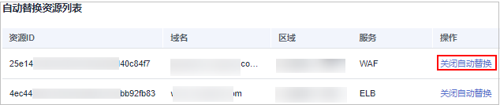

# 关闭SSL证书到期自动替换

部署到华为云产品的SSL证书不再需要到期自动替换，请参见本章节进行处理。

## 前提条件

部署到华为云产品的SSL证书已开启到期自动替换。

## 操作步骤

1.  登录[管理控制台](https://console.huaweicloud.com/)。
2.  单击页面左上方的，选择“安全与合规  \>  云证书管理服务“，进入云证书管理界面。
3.  在左侧导航栏选择“SSL证书管理 \> SSL证书列表“，进入SSL证书列表页面。
4.  在目标证书所在行的“操作“列，单击“部署证书“，系统从右面弹出证书部署详细页面，如[图1](#ccm_01_0321_zh-cn_topic_0000001124217559_zh-cn_topic_0114377953_fig4429445388)所示。

    **图 1**  部署证书  
    

5.  在自动替换资源列表中，选择需要关闭自动替换的域名，并单击“操作“列的“关闭自动替换“。

    **图 2**  关闭自动替换  
    

6.  自动替换资源列表中不再含有该域名资源，表示关闭自动替换成功。

