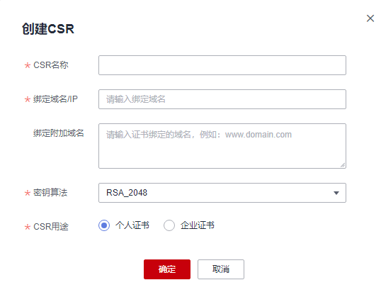

# 创建CSR

## 操作步骤

1.  登录[管理控制台](https://console.huaweicloud.com/)。
2.  单击页面左上方的，选择“安全与合规  \>  云证书管理服务“，进入云证书管理界面。
3.  在左侧导航栏选择“SSL证书管理 \>SSL证书证书列表 \> CSR管理“，进入CSR管理界面。
4.  单击“创建CSR“。
5.  在弹出页面完成参数配置，如[图 创建CSR](#fig161011562080)。

    **图 1**  创建CSR  
    

    参数说明如[表 参数说明](#table661012561811)。

    **表 1**  参数说明

    
    <table><thead align="left"><tr id="row18610956489"><th class="cellrowborder" valign="top" width="50%" id="mcps1.2.3.1.1">
参数名称

    </th>
    <th class="cellrowborder" valign="top" width="50%" id="mcps1.2.3.1.2">
参数说明

    </th>
    </tr>
    </thead>
    <tbody><tr id="row761019561982"><td class="cellrowborder" valign="top" width="50%" headers="mcps1.2.3.1.1 ">
CSR名称

    </td>
    <td class="cellrowborder" valign="top" width="50%" headers="mcps1.2.3.1.2 ">
为创建的CSR自定义一个名称。

    
支持使用英文大小写字母（a~z和A~Z）、阿拉伯数字（0~9）、下划线（_）、短划线（-）。长度不超过50个字符。

    </td>
    </tr>
    <tr id="row106113561286"><td class="cellrowborder" valign="top" width="50%" headers="mcps1.2.3.1.1 ">
绑定域名/IP

    </td>
    <td class="cellrowborder" valign="top" width="50%" headers="mcps1.2.3.1.2 ">
填写要申请证书的域名。

    
如果您想在提交证书申请时使用该CSR，必须确保证书绑定域名包含此处设置的域名。

    
示例：假设您在此处设置域名为huaweiyun.com，则证书申请中的证书绑定域名必须包含huaweiyun.com，才可以匹配到该CSR。

    </td>
    </tr>
    <tr id="row8611556884"><td class="cellrowborder" valign="top" width="50%" headers="mcps1.2.3.1.1 ">
绑定附加域名

    </td>
    <td class="cellrowborder" valign="top" width="50%" headers="mcps1.2.3.1.2 ">
填写与已设置的域名共用一张证书的其他域名。支持填写多个域名，多域名之间使用半角逗号（,）分隔。

    </td>
    </tr>
    <tr id="row18611195616811"><td class="cellrowborder" valign="top" width="50%" headers="mcps1.2.3.1.1 ">
密钥算法

    </td>
    <td class="cellrowborder" valign="top" width="50%" headers="mcps1.2.3.1.2 ">
选择密钥算法的类型。可选项：

    <ul id="ul126114569810"><li>RSA_2048</li><li>RSA_3072</li><li>RSA_4096</li><li>EC_P256</li><li>EC_P384</li><li>SM2</li></ul>
    </td>
    </tr>
    <tr id="row126123566815"><td class="cellrowborder" valign="top" width="50%" headers="mcps1.2.3.1.1 ">
CSR用途

    </td>
    <td class="cellrowborder" valign="top" width="50%" headers="mcps1.2.3.1.2 ">
选择您生成的CSR用途。可选项：

    <ul id="ul166129567813"><li>个人证书</li><li>企业证书</li></ul>
    </td>
    </tr>
    </tbody>
    </table>

6.  单击“确定“生成CSR。

## 后续操作

-   完成创建CSR后，您可以在CSR列表 查看已创建的CSR详情。
-   后续您在提交证书申请时，可以将**CSR生成方式**设置为**选择已有的CSR**并从匹配到的CSR中选择目标CSR。

    > **说明：** 
    >您还可以在CSR列表的操作栏对现有CSR进行“编辑“和“删除“操作。
    >-   编辑操作仅支持修改CSR名称。
    >-   删除CSR后无法恢复，请谨慎操作。

