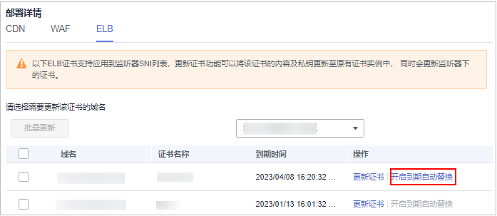
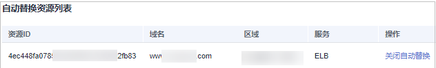

# 开启SSL证书到期自动替换

对于部署到华为云产品的SSL证书，如果为多年有效期或已开启自动续费的SSL证书，支持开启证书到期自动替换。

开启证书到期自动替换后，在旧证书到期前，多年期后续证书或自动续费的证书签发后24小时内将自动更新到已部署的华为云产品替换旧证书。

> **注意：** 
>为了避免多年期证书自动申请失败，**请勿取消隐私授权**。

## 前提条件

-   SSL证书已部署到华为云产品。
-   证书为多年有效期SSL证书（剩余证书张数大于0）或已为SSL证书开启自动续费。

## 约束条件

开启到期自动替换后，在旧证书过期前，新签发的多年期后续证书或续费证书将由云证书管理服务自动更新到已部署的华为云产品替换旧证书，为了保证证书自动替换成功，您必须在旧证书过期前配合CA机构完成新证书签发。否则，在旧证书过期后，到期自动替换功能失效，新签发的多年期后续证书或续费证书您需要手动部署到华为云产品中。

## 操作步骤

1.  登录[管理控制台](https://console.huaweicloud.com/)。
2.  单击页面左上方的，选择“安全与合规  \>  云证书管理服务“，进入云证书管理界面。
3.  在左侧导航栏选择“SSL证书管理 \> SSL证书列表“，进入SSL证书列表页面。
4.  在目标证书所在行的“操作“列，单击“部署证书“，系统从右面弹出证书部署详细页面，如[图1](#ccm_01_0321_zh-cn_topic_0000001124217559_zh-cn_topic_0114377953_fig4429445388)所示。

    **图 1**  部署证书  
    

5.  在证书部署详情页面中的“部署详情“栏中，选择已部署的云产品。

    **图 2**  选择云产品  
    

6.  （可选）当部署的云产品为WAF或ELB时需要执行此步骤。

    单击区域名称右侧的，选择部署的区域。

7.  选择需要开启到期自动替换的域名，并单击“操作“列的“开启到期自动替换“。

    **图 3**  开启到期自动替换  
    

8.  在弹出的确认框中确认信息，确认无误后单击“确认“。
9.  自动替换资源列表中出现该域名资源，表示开启到期自动替换成功。

    **图 4**  开启到期自动替换成功  
    

