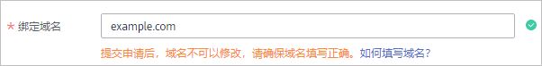
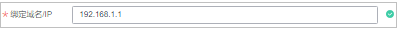
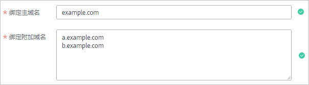
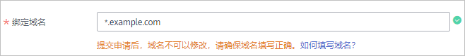

# 提交SSL证书申请

成功购买证书后，您需要申请证书，即为证书绑定域名或IP、填写证书申请人的详细信息并提交审核。所有信息通过审核后，证书颁发机构才签发证书。

本章节将介绍申请证书的详细操作。

## 前提条件

已购买SSL证书且状态为“待申请“，购买证书详细操作请参见[购买SSL证书](购买SSL证书.md)。

## 约束限制

-   绑定域名时，如果需要绑定中文域名，请单击访问[Punycode官网](https://www.punycoder.com/)使用**Punycode编码**工具将中文域名编码，再使用编码后信息来申请证书。
-   如果您申请的DV证书，绑定的域名含有edu、gov、bank、live等敏感词，可能无法通过安全审核，建议选择OV或EV证书，目前已知敏感词请参见[敏感词](https://support.huaweicloud.com/ccm_faq/ccm_01_0193.html#section1)。
-   由于各个证书品牌针对www型域名有不同的惠赠活动，具体请参见[证书品牌](https://support.huaweicloud.com/productdesc-ccm/ccm_01_0219.html#section0)。

## 操作步骤

1.  登录[管理控制台](https://console.huaweicloud.com/)。
2.  单击页面左上方的，选择“安全与合规  \>  云证书管理服务“，进入云证书管理界面。
3.  在左侧导航栏选择“SSL证书管理 \>  SSL证书列表“，并在SSL证书列表待申请证书所在行的“操作“列，单击“申请证书“，系统从右面弹出申请证书详细页面。
4.  在弹出申请证书详细页面中，填写域名、企业组织和申请人等信息。

    **图 1**  域名及其他信息  
    

    1.  **证书请求文件**

        证书请求文件（Certificate Signing Request，CSR）即证书签名申请，包含了您的服务器信息和公司信息。申请证书时需要将您证书的CSR文件提交给CA认证中心审核。

        选择证书请求文件生成方式：

        -   系统生成CSR（**推荐**）：系统将自动帮您生成证书私钥，并且您可以在证书申请成功后直接在证书管理页面下载您的证书和私钥。
        -   选择已有CSR：手动选择您在CSR管理列表已创建或已上传的CSR文件，创建CSR的详细操作请参见[创建CSR](https://support.huaweicloud.com/usermanual-ccm/ccm_01_0363.html)，上传CSR的详细操作请参见[上传CSR](https://support.huaweicloud.com/usermanual-ccm/ccm_01_0364.html)。
        -   自己生成CSR：手动生成CSR文件并将文件内容复制到CSR文件内容对话框中。详细操作请参见[如何制作CSR文件？](https://support.huaweicloud.com/ccm_faq/ccm_01_0059.html)。

        两种证书请求文件的区别请参见[系统生成的CSR和自己生成CSR的区别？](https://support.huaweicloud.com/ccm_faq/ccm_01_0234.html)。

    2.  **绑定域名或IP**
        -   当“证书请求文件“选择“自己生成CSR“时，域名将根据CSR文件自动解析出来，不需要手动输入域名或IP。
        -   当“证书请求文件“选择“系统生成CSR“时，需要手动输入证书需要绑定的域名或IP。

            **表 1**  绑定域名或IP

            
            <table><thead align="left"><tr id="zh-cn_topic_0000001124518813_row13150528114214"><th class="cellrowborder" valign="top" width="24.7%" id="mcps1.2.3.1.1">
类型

            </th>
            <th class="cellrowborder" valign="top" width="75.3%" id="mcps1.2.3.1.2">
填写说明

            </th>
            </tr>
            </thead>
            <tbody><tr id="zh-cn_topic_0000001124518813_row015062819424"><td class="cellrowborder" valign="top" width="24.7%" headers="mcps1.2.3.1.1 ">
<strong id="zh-cn_topic_0000001124518813_b41271042165217">单域名</strong>

            </td>
            <td class="cellrowborder" valign="top" width="75.3%" headers="mcps1.2.3.1.2 ">
填写需要绑定的1个域名。

            
例如，需要绑定域名为example.com，则填写如下图所示：

            

            </td>
            </tr>
            <tr id="row19114062913"><td class="cellrowborder" valign="top" width="24.7%" headers="mcps1.2.3.1.1 ">
<strong id="b384710172447">单IP</strong>

            </td>
            <td class="cellrowborder" valign="top" width="75.3%" headers="mcps1.2.3.1.2 ">
填写需要绑定的1个公网IP。

            
例如，需要绑定的域名为192.168.1.1，则填写如下图所示：

            

            </td>
            </tr>
            <tr id="zh-cn_topic_0000001124518813_row121501528164216"><td class="cellrowborder" valign="top" width="24.7%" headers="mcps1.2.3.1.1 ">
<strong id="zh-cn_topic_0000001124518813_b6509844115220">多域名</strong>

            </td>
            <td class="cellrowborder" valign="top" width="75.3%" headers="mcps1.2.3.1.2 ">
需要绑定<strong id="zh-cn_topic_0000001124518813_b16017568561">主域名</strong>和<strong id="zh-cn_topic_0000001124518813_b7018563569">附加域名</strong>。

            
例如，需要绑定域名为example.com、a.example.com和b.example.com，则填写如下图所示：

            

            
 说明： 
<ul id="zh-cn_topic_0000001124518813_ul1059585516571"><li>附加域名须<strong id="zh-cn_topic_0000001124518813_b1183511422010">大于等于1个</strong>。附加域名可分批次进行录入，具体操作请参见<a href="https://support.huaweicloud.com/usermanual-ccm/ccm_01_0069.html" target="_blank" rel="noopener noreferrer">新增附加域名</a>。</li><li>多个附加域名请换行输入。</li><li>如果购买的是组合证书（单域名+泛域名），<strong id="zh-cn_topic_0000001124518813_b185091722502">主域名同时支持绑定单域名和泛域名</strong>。</li><li>主域名和附加域名的关系（主从关系）对添加的域名没有影响。</li><li>仅当证书类型为OV、OV Pro时，多个域名中可包含泛域名。其他类型的证书，仅支持绑定多个单域名。</li></ul>
            

            

            </td>
            </tr>
            <tr id="zh-cn_topic_0000001124518813_row715018285427"><td class="cellrowborder" valign="top" width="24.7%" headers="mcps1.2.3.1.1 ">
<strong id="zh-cn_topic_0000001124518813_b699524615525">泛域名</strong>

            </td>
            <td class="cellrowborder" valign="top" width="75.3%" headers="mcps1.2.3.1.2 ">
填写需要绑定的1个泛域名。

            
例如，需要绑定域名为*.example.com，则填写如下图所示：

            

            </td>
            </tr>
            <tr id="zh-cn_topic_0000001124518813_row261554719433"><td class="cellrowborder" colspan="2" valign="top" headers="mcps1.2.3.1.1 mcps1.2.3.1.2 ">
如果需要绑定中文域名，请单击访问<a href="https://www.punycoder.com/" target="_blank" rel="noopener noreferrer">Punycode官网</a>使用<strong id="b42872371637">Punycode编码</strong>工具将中文域名编码，再填写编码后信息。

            
示例：<strong id="zh-cn_topic_0000001124518813_b1499785814310">华为云.com</strong> Punycode 编码后：<strong id="zh-cn_topic_0000001124518813_b699745834313">xn--siq1ht8k.com</strong>，则在“绑定域名”中填写xn--siq1ht8k.com

            </td>
            </tr>
            </tbody>
            </table>

    3.  **根证书哈希算法**

        当您选购的证书为“GeoTrust“或“DigiCert“品牌的OV证书时，如果您有特殊需求可以将根证书哈希算法设置为“SHA-256“，如果没有特殊需求，请保持选项为“默认“。

        > **须知：** 
        >根证书哈希算法选择“SHA-256“在旧版浏览器中可能存在兼用性问题。

    4.  **密钥算法**

        选择待申请证书的加密算法，加密算法默认为“RSA\_2048“。可选择的加密算法类型：

        -   **RSA**：目前在全球应用广泛的非对称加密算法，兼容性在三种算法中最好，支持主流浏览器和全平台操作系统。一般采用2048位或3072位的加密长度。
        -   **ECC**：椭圆曲线加密算法。相比于RSA，ECC加密速度快、效率更高、服务器资源消耗低，目前已在主流浏览器中得到推广，成为新一代主流算法。一般采用256位加密长度。
        -   **SM2**：中国国家密码管理局发布的ECC椭圆曲线加密算法，在中国商用密码体系中用来替代RSA算法。

        各类证书支持的加密算法详情请参见[证书支持的加密算法](https://support.huaweicloud.com/productdesc-ccm/ccm_01_0219.html#section3)。

        > **须知：** 
        >申请国密证书时，加密算法请选择“SM2“。

    5.  **企业组织信息**

        请根据界面提示填写您的企业组织信息。

        > **说明：** 
        >-   仅OV、EV类型的证书需要填写此项。
        >-   公司名称请填写营业执照注册公司的全称。

    6.  **申请人信息**
        -   请确保此处填写的申请人电话和邮箱填写准确，CA机构人员会在审核过程中通过邮箱和电话联系您。
        -   申请人信息涉及用户个人信息的内容，证书签发后**不会**包含在证书中。

    7.  **技术联系人信息**

        此项信息为选填项，如填写，请确保填写的技术联系人姓名、电话和邮箱信息准确。

5.  确认填写信息无误后，阅读《云证书管理服务（CCM）免责声明》、《隐私政策声明》和信息授权声明，并勾选声明内容前面的框。
6.  单击“提交申请“。

    系统会将您的申请提交到CA认证机构，请您**保持电话畅通**，并**及时查阅**邮箱中来自CA认证机构的电子**邮件**。

## 后续处理

-   补充申请资料
    -   CFCA品牌的证书提交证书申请后，CFCA机构将在1-2个工作日内给您提交申请时填写的邮箱发送一封邮件要求您提供盖**公司公章**的CFCA证书申请表（确保控制台申请信息与申请表申请信息一致）、营业执照复印件和经办人身份证复印件进行组织身份验证。请您按照要求提供相关资料。
    -   vTrus品牌的国际标准（RSA）证书提交证书申请后，vTrus机构将在1-2个工作日内给您提交申请时填写的邮箱发送一封邮件要求您提供盖**公司公章**或**部门章**的授权函、经办人身份证复印件进行组织身份验证。请您按照要求提供相关资料。

-   提交审核后，CA颁发机构将在2-3个工作日内对您提交的申请进行处理并给您填写的邮箱发送一封验证邮件。

    您需要按照要求进行域名验证。具体操作请参见[域名验证](域名验证.md)。

-   如果已提交了证书申请，发现信息填写错误，可撤销申请，修改信息后重新提交证书申请，撤回申请具体操作请参见[撤回证书申请](撤回SSL证书申请.md)。

