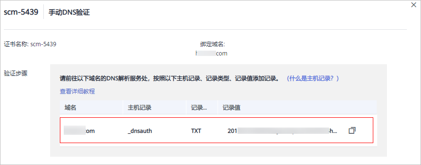
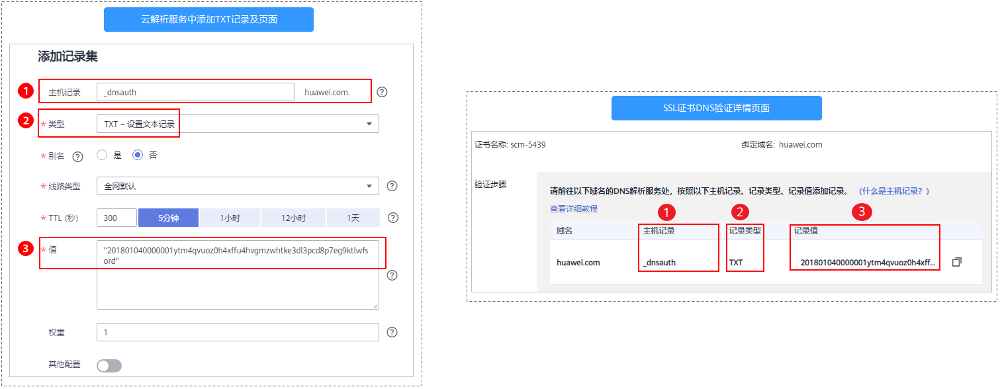
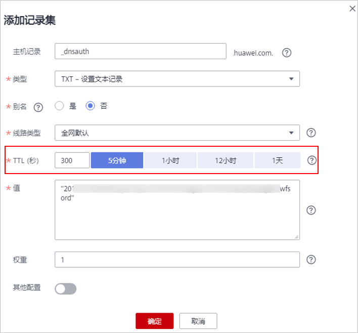

# 方式二：手动DNS验证

按照CA中心的规范，如果您申请了SSL证书，则必须完成域名验证（又称验证域名所有权）来证明待申请证书要绑定的域名属于您。

手动DNS验证，是指您需要在域名的DNS解析服务商手动修改域名的DNS解析记录，在解析记录中添加一条用于验证的记录。CA机构验证添加的记录能被解析，则表示验证通过。

如果您在申请证书时域名验证方式选择了手动DNS验证，请参照本章节进行处理。

## 约束与限制

手动DNS验证的域名解析只能在您的域名管理平台上进行操作，具体的解析方法以域名服务商提供的解析方法为准。

## 前提条件

绑定的域名须做实名认证，如果未做实名认证，请前往您的域名服务商处完成域名实名认证。

## 步骤一：确认验证步骤

**DNS验证只能在域名管理平台（即您的域名托管平台）上进行解析**。请根据域名管理平台类型执行验证步骤：

<table><thead align="left"><tr id="row0199169202316"><th class="cellrowborder" valign="top" width="20.06%" id="mcps1.1.3.1.1">
域名管理平台类型

</th>
<th class="cellrowborder" valign="top" width="79.94%" id="mcps1.1.3.1.2">
验证步骤

</th>
</tr>
</thead>
<tbody><tr id="row01996932316"><td class="cellrowborder" valign="top" width="20.06%" headers="mcps1.1.3.1.1 ">
域名管理平台是华为云

</td>
<td class="cellrowborder" valign="top" width="79.94%" headers="mcps1.1.3.1.2 ">
继续执行后续所有步骤。

</td>
</tr>
<tr id="row71991799233"><td class="cellrowborder" valign="top" width="20.06%" headers="mcps1.1.3.1.1 ">
域名管理平台不是华为云

</td>
<td class="cellrowborder" valign="top" width="79.94%" headers="mcps1.1.3.1.2 ">
请确认是否愿意把域名从其他服务商迁移到华为云DNS？<ul id="ul286223015245"><li>是。请执行以下操作步骤：<ol id="ol11862330202419"><li>请参见<a href="https://support.huaweicloud.com/dns_faq/dns_faq_001.html" target="_blank" rel="noopener noreferrer">怎样把域名从其他服务商迁移到华为云DNS？</a>，把域名从其他服务商迁移到华为云DNS。</li><li>继续执行后续所有步骤。</li></ol>
</li><li>否。请在相应的平台上进行DNS验证。例如，域名托管在阿里云，则需要到阿里云的云解析DNS控制台进行相关配置。</li></ul>

</td>
</tr>
</tbody>
</table>

## 步骤二：获取验证信息

1.  登录[管理控制台](https://console.huaweicloud.com/)。
2.  单击页面左上方的，选择“安全与合规  \>  云证书管理服务“，进入云证书管理界面。
3.  在左侧导航栏选择“SSL证书管理“，并SSL证书页面中待域名验证的证书所在行的“操作“列，单击“域名验证“，系统从右面弹出域名验证详细页面。
4.  在证书的域名验证页面，查看并记录“主机记录“、“记录类型“和“记录值“，如[图1](#zh-cn_topic_0000001169740848_fig1272351623219)所示。

    如果界面未显示，则请登录邮箱（申请证书时填写的邮箱）进行查看。

    **图 1**  查看主机记录  
    

## 步骤三：在华为云云解析服务上进行DNS验证

1.  登录[管理控制台](https://console.huaweicloud.com/)。
2.  选择“网络  \>  云解析服务“，并在云解析页面左侧导航栏，选择“公网域名“，进入“公网域名“页面。
3.  在“公网域名“页面的域名列表中，单击待添加记录集的域名，并在解析记录页面右上角单击“添加记录集“，进入“添加记录集“页面。

    > **说明：** 
    >-   不同域名类型的证书做DNS验证时，需要添加记录集的域名如下：
    >    -   单域名证书，为证书绑定的域名添加记录集（域名带www时例外，域名带www时为其上一级域名添加记录集。例如证书绑定的域名为www.example.com，为域名example.com添加记录集）。
    >    -   多域名证书，需要为证书绑定的所有域名添加记录集。
    >    -   泛域名证书，为泛域名相应的上一级域名添加记录集。
    >        例如：证书绑定的域名为\*.example.com，只需为域名example.com添加记录集。
    >-   如果在“解析记录“的域名列表中，已存在带解析域名且相同记录类型的记录值，直接在目标域名的“操作“列，单击“修改“，进入“修改记录集“页面。

    **图 2**  添加记录集  
    

    **表 1**  添加记录集参数说明

    
    <table><thead align="left"><tr id="zh-cn_topic_0000001169740848_row18461150152415"><th class="cellrowborder" valign="top" width="19.57%" id="mcps1.2.3.1.1">
参数名称

    </th>
    <th class="cellrowborder" valign="top" width="80.43%" id="mcps1.2.3.1.2">
参数说明

    </th>
    </tr>
    </thead>
    <tbody><tr id="zh-cn_topic_0000001169740848_row14461140172417"><td class="cellrowborder" valign="top" width="19.57%" headers="mcps1.2.3.1.1 ">
<strong id="zh-cn_topic_0000001169740848_b48623202716">主机记录</strong>

    </td>
    <td class="cellrowborder" valign="top" width="80.43%" headers="mcps1.2.3.1.2 ">
证书的“域名验证”页面，域名服务商返回的“主机记录”。

    </td>
    </tr>
    <tr id="zh-cn_topic_0000001169740848_row346119011242"><td class="cellrowborder" valign="top" width="19.57%" headers="mcps1.2.3.1.1 ">
<strong id="zh-cn_topic_0000001169740848_b934916613275">类型</strong>

    </td>
    <td class="cellrowborder" valign="top" width="80.43%" headers="mcps1.2.3.1.2 ">
证书的“域名验证”页面，域名服务商返回的“记录类型”。

    </td>
    </tr>
    <tr id="zh-cn_topic_0000001169740848_row2814104310328"><td class="cellrowborder" valign="top" width="19.57%" headers="mcps1.2.3.1.1 ">
别名

    </td>
    <td class="cellrowborder" valign="top" width="80.43%" headers="mcps1.2.3.1.2 ">
选择“否”。

    </td>
    </tr>
    <tr id="zh-cn_topic_0000001169740848_row19461905246"><td class="cellrowborder" valign="top" width="19.57%" headers="mcps1.2.3.1.1 ">
线路类型

    </td>
    <td class="cellrowborder" valign="top" width="80.43%" headers="mcps1.2.3.1.2 ">
选择“全网默认”。

    </td>
    </tr>
    <tr id="zh-cn_topic_0000001169740848_row134611801240"><td class="cellrowborder" valign="top" width="19.57%" headers="mcps1.2.3.1.1 ">
TTL (秒)

    </td>
    <td class="cellrowborder" valign="top" width="80.43%" headers="mcps1.2.3.1.2 ">
一般建议设置为5分钟。TTL值越大，则DNS记录的同步和更新越慢。

    </td>
    </tr>
    <tr id="zh-cn_topic_0000001169740848_row5360938132418"><td class="cellrowborder" valign="top" width="19.57%" headers="mcps1.2.3.1.1 ">
<strong id="zh-cn_topic_0000001169740848_b131981198274">值</strong>

    </td>
    <td class="cellrowborder" valign="top" width="80.43%" headers="mcps1.2.3.1.2 ">
证书的“域名验证”页面，域名服务商返回的“记录值”。

    
 说明： 

记录值必须用英文引号引用后粘贴在文本框中。

    

    </td>
    </tr>
    <tr id="zh-cn_topic_0000001169740848_row10837134414246"><td class="cellrowborder" colspan="2" valign="top" headers="mcps1.2.3.1.1 mcps1.2.3.1.2 ">
其他的设置保持不变。

    </td>
    </tr>
    </tbody>
    </table>

4.  单击“确定“，记录集添加成功。

    当记录集的状态显示为“正常“时，表示记录集添加成功。

    > **说明：** 
    >该记录集在证书签发后才可以删除。

## 步骤四：查看域名验证是否生效

1.  在Windows系统中，单击“开始“，输入“cmd“，进入命令提示符对话框。
2.  根据不同的记录类型，选择执行[表 验证命令](#table1424551951911)所示命令，查看DNS验证配置是否已经生效。

    **表 2**  验证命令

    
    <table><thead align="left"><tr id="row924661921912"><th class="cellrowborder" valign="top" width="23.630000000000003%" id="mcps1.2.3.1.1">
记录类型

    </th>
    <th class="cellrowborder" valign="top" width="76.37%" id="mcps1.2.3.1.2">
验证命令

    </th>
    </tr>
    </thead>
    <tbody><tr id="row1624611961920"><td class="cellrowborder" valign="top" width="23.630000000000003%" headers="mcps1.2.3.1.1 ">
TXT

    </td>
    <td class="cellrowborder" valign="top" width="76.37%" headers="mcps1.2.3.1.2 ">
<b>nslookup -q=TXT</b> <i>xxx</i>

    </td>
    </tr>
    <tr id="row1024611193197"><td class="cellrowborder" valign="top" width="23.630000000000003%" headers="mcps1.2.3.1.1 ">
CNAME

    </td>
    <td class="cellrowborder" valign="top" width="76.37%" headers="mcps1.2.3.1.2 ">
<b>nslookup -q=CNAME</b> <i>xxx</i>

    </td>
    </tr>
    </tbody>
    </table>

    > **说明：** 
    >_xxx_代表域名服务商返回的“主机记录“值。

    -   如果界面回显的记录值（text的值）与域名服务商返回的“记录值“一致，如[图3](#zh-cn_topic_0000001169740848_fig1141255248)所示，说明域名授权验证配置已经生效。

        **图 3**  域名授权验证配置生效  
        

    -   如果界面未回显记录值，显示为“Non-existent domain“，说明域名授权验证配置未生效。

        **图 4**  域名授权验证配置未生效  
        

3.  如果DNS验证配置未生效，请根据以下可能原因进行排除修改，直至验证生效。

    **表 3**  排查处理

    
    <table><thead align="left"><tr id="zh-cn_topic_0000001169740848_row1828919251041"><th class="cellrowborder" valign="top" width="28.939999999999998%" id="mcps1.2.3.1.1">
可能原因

    </th>
    <th class="cellrowborder" valign="top" width="71.06%" id="mcps1.2.3.1.2">
处理方法

    </th>
    </tr>
    </thead>
    <tbody><tr id="row3835259114413"><td class="cellrowborder" valign="top" width="28.939999999999998%" headers="mcps1.2.3.1.1 ">
域名管理平台选择错误

    </td>
    <td class="cellrowborder" valign="top" width="71.06%" headers="mcps1.2.3.1.2 ">
DNS验证只能在域名管理平台（即您的域名托管平台）上进行解析，请确认您进行DNS验证的平台是否为您的域名托管平台。

    </td>
    </tr>
    <tr id="row72411331111615"><td class="cellrowborder" valign="top" width="28.939999999999998%" headers="mcps1.2.3.1.1 ">
旧解析记录未删除

    </td>
    <td class="cellrowborder" valign="top" width="71.06%" headers="mcps1.2.3.1.2 ">
证书签发后添加的解析记录即可删除。

    
若您上一次申请证书时添加的解析记录未删除，本次申请证书添加的解析记录将不会生效，请您确认是否未删除上一次解析记录。

    </td>
    </tr>
    <tr id="zh-cn_topic_0000001169740848_row62896252047"><td class="cellrowborder" valign="top" width="28.939999999999998%" headers="mcps1.2.3.1.1 ">
记录配置出错

    </td>
    <td class="cellrowborder" valign="top" width="71.06%" headers="mcps1.2.3.1.2 ">
请您检查“主机记录”、“类型”或“记录值”是否填写正确。

    
<b>图1 </b>配置记录 

    </td>
    </tr>
    <tr id="zh-cn_topic_0000001169740848_row1428962511415"><td class="cellrowborder" valign="top" width="28.939999999999998%" headers="mcps1.2.3.1.1 ">
配置的生效时间过长，生效时间还未到，因此无法查询到数据。

    </td>
    <td class="cellrowborder" valign="top" width="71.06%" headers="mcps1.2.3.1.2 ">
请您检查生效时间（TTL）是否设置过长，建议将生效时间修改为5分钟。不同的域名提供商的DNS配置不一样，如华为云的DNS（云解析服务）默认是5分钟后生效，如下图所示。

    
若配置的生效时间未到，请等时间到了后再进行验证。

    
<b>图2 </b>生效时间 

    </td>
    </tr>
    </tbody>
    </table>

## 步骤五：DNS验证结果审核

-   **OV、EV证书**

    按CA机构审核邮件要求完成验证后，请耐心等待，CA机构需要2-3个工作日对DNS验证信息进行审核，审核通过后，才会签发证书。

    如遇验证失败或其他问题，请根据CA机构审核邮件中提供的联系方式，与CA机构联系。

-   **DV证书**

    您可以在域名验证页面，手动验证结果。

    1.  登录[管理控制台](https://console.huaweicloud.com/)。
    2.  单击页面左上方的，选择“安全与合规  \>  云证书管理服务“，进入云证书管理界面。
    3.  在左侧导航栏选择“SSL证书管理“，并SSL证书页面中待域名验证的证书所在行的“操作“列，单击“域名验证“，系统从右面弹出域名验证详细页面。
    4.  单击“验证“，验证DNS解析配置。
        -   界面提示“验证成功，证书签发审核中，请等待“：证书将在1分钟内签发，请您及时刷新页面查看证书状态。
        -   验证失败，请参照[DV证书DNS验证失败如何处理？](#section208510215313)排查并修改问题后，等待3-5分钟重新验证。

## DV证书DNS验证失败如何处理？

<table><thead align="left"><tr id="row128501126313"><th class="cellrowborder" valign="top" width="24.26%" id="mcps1.1.3.1.1">
失败提示信息

</th>
<th class="cellrowborder" valign="top" width="75.74%" id="mcps1.1.3.1.2">
解决方案

</th>
</tr>
</thead>
<tbody><tr id="row385092932"><td class="cellrowborder" valign="top" width="24.26%" headers="mcps1.1.3.1.1 ">
提交验证频繁，请稍后再试

</td>
<td class="cellrowborder" valign="top" width="75.74%" headers="mcps1.1.3.1.2 ">
验证过于频繁，建议您等待3-5分钟后，执行验证操作。

</td>
</tr>
<tr id="row15851722312"><td class="cellrowborder" valign="top" width="24.26%" headers="mcps1.1.3.1.1 ">
DNS记录值不匹配

</td>
<td class="cellrowborder" valign="top" width="75.74%" headers="mcps1.1.3.1.2 ">
您配置的DNS记录值不正确，请参照<a href="https://support.huaweicloud.com/usermanual-ccm/ccm_01_0078.html#section3" target="_blank" rel="noopener noreferrer">步骤二：获取验证信息</a>获取正确记录值后，重新配置。

</td>
</tr>
<tr id="row9851821036"><td class="cellrowborder" valign="top" width="24.26%" headers="mcps1.1.3.1.1 ">
DNS验证失败，请稍后再试。

</td>
<td class="cellrowborder" valign="top" width="75.74%" headers="mcps1.1.3.1.2 ">
请排查是否存在以下问题：

<ul id="ul3851328319"><li>可能问题一：DNS记录值配置未生效。
解决方案：DNS记录值配置完后不会立即生效（具体生效时间为您域名服务器中设置的TTL缓存时间），建议您等待3-5分钟后，执行验证操作。

</li><li>可能问题二：DNS记录值正确配置，且一段时间后验证依然失败。
解决方案：CA验证服务器位于国外，部分时间可能存在网络问题，导致验证DNS失败，请等待1-2小时，或尝试重新发起申请。

</li><li>可能问题三：域名未完成备案或实名认证。
解决方案：请完成域名备案和实名认证后，进行域名所有权验证。

</li><li>可能问题四：域名存在CAA类型的解析记录。
解决方案：CAA记录会导致验证失败，您需要在域名解析记录中删除所有CAA类型的记录。

</li><li>可能问题五：CA验证服务器没有检测到DNS解析记录。
解决方案：CA验证服务器位于国外，需要您放开该域名国外的访问限制。

</li></ul>
</td>
</tr>
</tbody>
</table>

