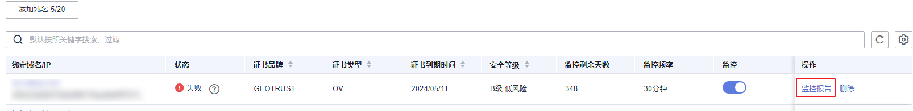

# 查看域名证书监控数据

本章节指导用户如何查看域名的监控数据，从域名安全等级分布、SSL证书到期预警、SSL漏洞扫描结果和合规检测结果等方面来展示域名和证书的安全状况。

## 操作步骤

1.  登录[管理控制台](https://auth.huaweicloud.com/)。
2.  单击页面左上方的，选择“安全与合规  \>  云证书管理服务“，进入云证书管理界面。
3.  在左侧导航栏选择“SSL证书管理 \>域名监控“，进入域名监控界面。
4.  查看已经添加的域名监控列表，显示的参数详情如[表 参数说明](#table82891755141515)。

    **表 1**  参数说明

    
    <table><thead align="left"><tr id="row16290115514159"><th class="cellrowborder" valign="top" width="50%" id="mcps1.2.3.1.1">
参数名称

    </th>
    <th class="cellrowborder" valign="top" width="50%" id="mcps1.2.3.1.2">
参数说明

    </th>
    </tr>
    </thead>
    <tbody><tr id="row12290205541518"><td class="cellrowborder" valign="top" width="50%" headers="mcps1.2.3.1.1 ">
绑定域名/IP

    </td>
    <td class="cellrowborder" valign="top" width="50%" headers="mcps1.2.3.1.2 ">
已添加至域名监控列表的域名或IP地址

    </td>
    </tr>
    <tr id="row3290145581518"><td class="cellrowborder" valign="top" width="50%" headers="mcps1.2.3.1.1 ">
证书品牌

    </td>
    <td class="cellrowborder" valign="top" width="50%" headers="mcps1.2.3.1.2 ">
已添加至域名监控列表的域名绑定的证书品牌

    </td>
    </tr>
    <tr id="row7290105519151"><td class="cellrowborder" valign="top" width="50%" headers="mcps1.2.3.1.1 ">
证书类型

    </td>
    <td class="cellrowborder" valign="top" width="50%" headers="mcps1.2.3.1.2 ">
已添加至域名监控列表的域名绑定的证书类型

    </td>
    </tr>
    <tr id="row829015517152"><td class="cellrowborder" valign="top" width="50%" headers="mcps1.2.3.1.1 ">
状态

    </td>
    <td class="cellrowborder" valign="top" width="50%" headers="mcps1.2.3.1.2 ">
域名监控状态：

    <ul id="ul2200742172314"><li>正常：域名监控状态正常。</li><li>失败：域名监控失败，可能原因为网络波动和域名填写有误。</li><li>未开启：未开启域名监控，可重新配置。</li><li>扫描中：已成功添加域名监控，正在对添加的域名进行扫描。</li></ul>
    </td>
    </tr>
    <tr id="row229055541514"><td class="cellrowborder" valign="top" width="50%" headers="mcps1.2.3.1.1 ">
证书到期时间

    </td>
    <td class="cellrowborder" valign="top" width="50%" headers="mcps1.2.3.1.2 ">
已添加域名绑定的证书到期时间

    </td>
    </tr>
    <tr id="row1729175520155"><td class="cellrowborder" valign="top" width="50%" headers="mcps1.2.3.1.1 ">
安全等级

    </td>
    <td class="cellrowborder" valign="top" width="50%" headers="mcps1.2.3.1.2 ">
安全等级由高至低依次分为A、B、C、D四个等级

    </td>
    </tr>
    <tr id="row16291175518151"><td class="cellrowborder" valign="top" width="50%" headers="mcps1.2.3.1.1 ">
监控剩余天数

    </td>
    <td class="cellrowborder" valign="top" width="50%" headers="mcps1.2.3.1.2 ">
每个域名监控的剩余天数

    </td>
    </tr>
    <tr id="row19614153841710"><td class="cellrowborder" valign="top" width="50%" headers="mcps1.2.3.1.1 ">
监控频率

    </td>
    <td class="cellrowborder" valign="top" width="50%" headers="mcps1.2.3.1.2 ">
已添加域名的监控频率，默认为30分钟

    </td>
    </tr>
    <tr id="row16111343111717"><td class="cellrowborder" valign="top" width="50%" headers="mcps1.2.3.1.1 ">
监控

    </td>
    <td class="cellrowborder" valign="top" width="50%" headers="mcps1.2.3.1.2 ">
：开启监控

    
：关闭监控

    </td>
    </tr>
    <tr id="row143144711714"><td class="cellrowborder" valign="top" width="50%" headers="mcps1.2.3.1.1 ">
操作

    </td>
    <td class="cellrowborder" valign="top" width="50%" headers="mcps1.2.3.1.2 "><ul id="ul76761654104512"><li>监控为开启状态时，操作栏可单击“监控报告”查看监控详情。</li><li>监控状态为关闭时，操作栏可单击“监控配置”重新配置域名监控参数。</li></ul>
    </td>
    </tr>
    </tbody>
    </table>

5.  单击“监控报告“如[图 查看监控报告](#fig25650494375)查看详细监控数据。

    **图 1**  查看监控报告  
    

6.  监控报告显示的信息详情如[表 监控数据详情](#table1936141319407)

    **表 2**  监控数据详情

    
    <table><thead align="left"><tr id="row1793751354015"><th class="cellrowborder" valign="top" width="37.18%" id="mcps1.2.3.1.1">
参数

    </th>
    <th class="cellrowborder" valign="top" width="62.82%" id="mcps1.2.3.1.2">
参数说明

    </th>
    </tr>
    </thead>
    <tbody><tr id="row1793741334018"><td class="cellrowborder" valign="top" width="37.18%" headers="mcps1.2.3.1.1 ">
概览

    </td>
    <td class="cellrowborder" valign="top" width="62.82%" headers="mcps1.2.3.1.2 ">
域名安全评级概览

    </td>
    </tr>
    <tr id="row79381613114012"><td class="cellrowborder" valign="top" width="37.18%" headers="mcps1.2.3.1.1 ">
监控状态

    </td>
    <td class="cellrowborder" valign="top" width="62.82%" headers="mcps1.2.3.1.2 "><ul id="ul19879253133618"><li>失败</li><li>正常</li><li>扫描中</li></ul>
    </td>
    </tr>
    <tr id="row169381613204013"><td class="cellrowborder" valign="top" width="37.18%" headers="mcps1.2.3.1.1 ">
ATS

    </td>
    <td class="cellrowborder" valign="top" width="62.82%" headers="mcps1.2.3.1.2 "><ul id="ul37651279377"><li>满足</li><li>不满足
 说明： 

当监控报告中显示ATS不满足时，可单击“查看详情”查看各检查项的扫描结果是否通过并进行逐一排查。

    

    </li></ul>
    </td>
    </tr>
    <tr id="row7938013114014"><td class="cellrowborder" valign="top" width="37.18%" headers="mcps1.2.3.1.1 ">
PCI DSS

    </td>
    <td class="cellrowborder" valign="top" width="62.82%" headers="mcps1.2.3.1.2 "><ul id="ul16202026183714"><li>满足</li><li>不满足
 说明： 

禁止使用TLS 1.1或更早的不安全传输加密协议，如此项不满足，则PCI DSS扫描结果为不满足。

    

    </li></ul>
    </td>
    </tr>
    <tr id="row6938613174017"><td class="cellrowborder" valign="top" width="37.18%" headers="mcps1.2.3.1.1 ">
优化建议

    </td>
    <td class="cellrowborder" valign="top" width="62.82%" headers="mcps1.2.3.1.2 ">
针对当前域名的安全评级等信息给出相应的优化建议

    </td>
    </tr>
    <tr id="row3938121344019"><td class="cellrowborder" valign="top" width="37.18%" headers="mcps1.2.3.1.1 ">
SSL证书信息

    </td>
    <td class="cellrowborder" valign="top" width="62.82%" headers="mcps1.2.3.1.2 "><ul id="ul49011126131910"><li>通用名称：当前SSL证书的通用名称</li><li>颁发者：当前SSL证书的颁发机构名称</li><li>加密算法：当前SSL证书使用的加密算法</li><li>签名算法：当前SSL证书使用的签名算法</li><li>证书透明（CT）true：当前证书签发行为透明公开</li><li>证书品牌：当前SSL证书的品牌名称</li><li>证书类型：当前SSL证书的类型</li><li>开始时间：当前SSL证书签发时间</li><li>结束时间：当前SSL证书到期时间</li><li>组织机构：组织名称</li><li>备用名称：当前SSL证书的备用名称</li></ul>
    </td>
    </tr>
    <tr id="row5914521182613"><td class="cellrowborder" valign="top" width="37.18%" headers="mcps1.2.3.1.1 ">
证书链信息

    </td>
    <td class="cellrowborder" valign="top" width="62.82%" headers="mcps1.2.3.1.2 "><ul id="ul6952145813217"><li>颁发给：需要颁发证书的域名</li><li>颁发者：SSL证书的颁发机构名称</li><li>有效期：证书有效期</li></ul>
    </td>
    </tr>
    <tr id="row7139047143918"><td class="cellrowborder" valign="top" width="37.18%" headers="mcps1.2.3.1.1 ">
协议

    </td>
    <td class="cellrowborder" valign="top" width="62.82%" headers="mcps1.2.3.1.2 ">
显示对于以下6种协议类型是否支持

    
TLS 1.3

    
TLS 1.2

    
TLS 1.1

    
TLS 1.0

    
SSL 3

    
SSL 2

    </td>
    </tr>
    <tr id="row19321616144514"><td class="cellrowborder" valign="top" width="37.18%" headers="mcps1.2.3.1.1 ">
SSL漏洞检测

    </td>
    <td class="cellrowborder" valign="top" width="62.82%" headers="mcps1.2.3.1.2 ">
SSL漏洞检测信息

    </td>
    </tr>
    <tr id="row1744614218461"><td class="cellrowborder" valign="top" width="37.18%" headers="mcps1.2.3.1.1 ">
套件

    </td>
    <td class="cellrowborder" valign="top" width="62.82%" headers="mcps1.2.3.1.2 ">
支持的加密套件详情

    </td>
    </tr>
    </tbody>
    </table>

