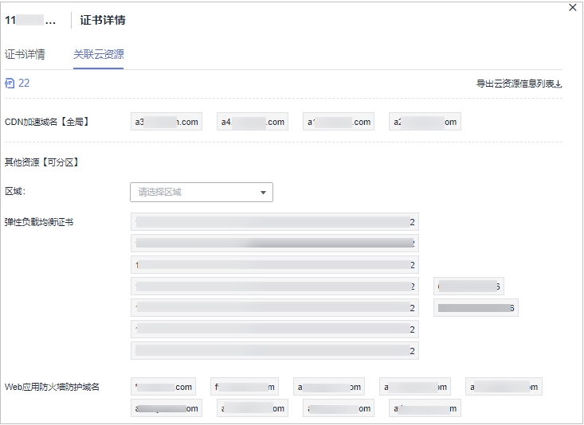

# 查看已关联云资源

您将SSL证书部署到华为云产品后，如需查看SSL证书已关联云产品的详细信息，请参照本章节处理。

## 前提条件

证书已部署到华为云产品。

## 操作步骤

1.  登录[管理控制台](https://console.huaweicloud.com/)。
2.  单击页面左上方的，选择“安全与合规  \>  云证书管理服务“，进入云证书管理界面。
3.  在左侧导航栏选择“SSL证书管理 \> SSL证书列表“，进入SSL证书列表页面。
4.  单击已完成部署的SSL证书的“名称/ID“，系统从右面弹出证书详情页面。
5.  选择“关联云资源“页签，查看证书已关联云资源，如[图 关联云资源详情](#fig3458164721115)所示，关联云资源参数说明如[表 关联云资源参数说明](#table3461164751114)所示。

    如需查看更详细的信息，可以单击页面右上角“导出云资源信息列表“，导出关联云资源信息列表，保存到本地查看。

    **图 1**  关联云资源详情  
    

    **表 1**  关联云资源参数说明

    
    <table><thead align="left"><tr id="row146018476118"><th class="cellrowborder" colspan="2" valign="top" id="mcps1.2.4.1.1">
参数名称

    </th>
    <th class="cellrowborder" valign="top" id="mcps1.2.4.1.2">
参数说明

    </th>
    </tr>
    </thead>
    <tbody><tr id="row1746064711110"><td class="cellrowborder" valign="top" width="9%" headers="mcps1.2.4.1.1 ">
全局服务

    </td>
    <td class="cellrowborder" valign="top" width="26.229999999999997%" headers="mcps1.2.4.1.1 ">
CDN加速域名

    </td>
    <td class="cellrowborder" valign="top" width="64.77000000000001%" headers="mcps1.2.4.1.2 ">
该证书已关联内容分发网络（CDN）服务中的加速域名。

    </td>
    </tr>
    <tr id="row08221213114418"><td class="cellrowborder" rowspan="3" valign="top" width="9%" headers="mcps1.2.4.1.1 ">
可分区服务

    </td>
    <td class="cellrowborder" valign="top" width="26.229999999999997%" headers="mcps1.2.4.1.1 ">
区域

    </td>
    <td class="cellrowborder" valign="top" width="64.77000000000001%" headers="mcps1.2.4.1.2 ">
选择ELB或WAF已部署该证书的区域。

    </td>
    </tr>
    <tr id="row1646024719111"><td class="cellrowborder" valign="top" headers="mcps1.2.4.1.1 ">
弹性负载均衡证书

    </td>
    <td class="cellrowborder" valign="top" headers="mcps1.2.4.1.1 ">
该证书已关联某区域弹性负载均衡（ELB）服务中的证书。

    </td>
    </tr>
    <tr id="row5460144761120"><td class="cellrowborder" valign="top" headers="mcps1.2.4.1.1 ">
Web应用刚火墙防护域名

    </td>
    <td class="cellrowborder" valign="top" headers="mcps1.2.4.1.1 ">
该证书已关联某区域Web应用防火墙（WAF）服务中“default”企业项目下的防护域名。

    
 说明： 

云证书管理服务中的证书只支持部署到WAF的“default”企业项目下，因此此处仅显示证书关联WAF“default”企业项目下的云资源。

    

    </td>
    </tr>
    </tbody>
    </table>

