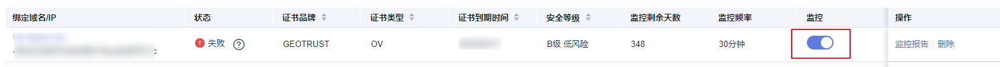
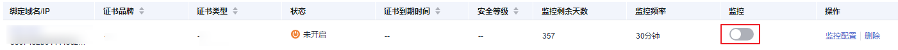
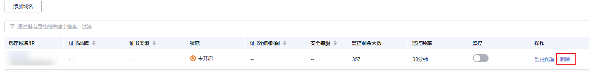

# 管理域名证书监控

当业务变化或当前添加的域名监控不符合您的业务需求时，您可以参考本章节关闭、开启、修改或删除已配置的域名监控。

## 关闭域名监控

前提条件

-   已添加域名监控。
-   域名监控功能为开启状态。

操作步骤

1.  登录[管理控制台](https://auth.huaweicloud.com/)。
2.  单击页面左上方的，选择“安全与合规  \>  云证书管理服务“，进入云证书管理界面。
3.  在左侧导航栏选择“SSL证书管理 \>域名监控“，进入域名监控界面。
4.  在域名监控列表找到需要关闭域名监控功能的域名，单击，如[图 关闭域名监控](#fig1858964916571)。

    **图 1**  关闭域名监控  
    

5.  在弹出框单击“确定“关闭当前域名的监控功能。

> **须知：** 
>域名监控成功添加后，监控剩余天数立即开始计时，关闭域名监控功能后计时不会停止。

## 开启域名监控

前提条件

-   已添加域名监控。
-   域名监控功能为关闭状态。

操作步骤

1.  登录[管理控制台](https://auth.huaweicloud.com/)。
2.  单击页面左上方的，选择“安全与合规  \>  云证书管理服务“，进入云证书管理界面。
3.  在左侧导航栏选择“SSL证书管理 \>域名监控“，进入域名监控界面。
4.  在域名监控列表找到需要开启域名监控功能的域名，单击，如[图 开启域名监控](#fig688539112011)。

    **图 2**  开启域名监控  
    

5.  在弹出框单击“确定“开启当前域名的监控功能。

## 修改域名监控配置

前提条件

-   已添加域名监控。
-   域名监控功能为关闭状态。

操作步骤

1.  登录[管理控制台](https://auth.huaweicloud.com/)。
2.  单击页面左上方的，选择“安全与合规  \>  云证书管理服务“，进入云证书管理界面。
3.  在左侧导航栏选择“SSL证书管理 \>域名监控“，进入域名监控界面。
4.  在域名监控列表找到需要修改配置的域名，在操作栏单击“监控配置“如[图 修改监控配置](#fig71413221718)。

    **图 3**  修改监控配置  
    

5.  在弹出框重新配置参数并单击“确定“完成配置修改。

## 删除域名证书监控

前提条件

已添加域名证书监控。

> **须知：** 
>域名证书监控开启或关闭状态都可以对其进行删除操作，请谨慎操作。

操作步骤

1.  登录[管理控制台](https://auth.huaweicloud.com/)。
2.  单击页面左上方的，选择“安全与合规  \>  云证书管理服务“，进入云证书管理界面。
3.  在左侧导航栏选择“SSL证书管理 \>域名监控“，进入域名监控界面。
4.  在域名监控列表找到需要删除的域名，在操作栏单击“删除“，如[图 删除域名监控](#fig1230316245207)

    **图 4**  删除域名证书监控  
    

5.  在弹出框单击“确定“，完成域名证书监控删除操作。

