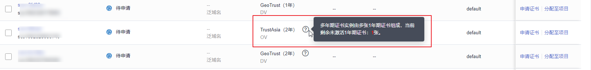

# 购买SSL证书

华为云云证书管理服务提供多个品牌和类型的证书，您可以根据需求购买SSL证书。

## 前提条件

购买证书的帐号拥有“SCM Administrator“/“SCM FullAccess“、“BSS Administrator“和“DNS Administrator“权限。

-   BSS Administrator：费用中心、资源中心、帐号中心的所有执行权限。项目级角色，在同项目中勾选。
-   DNS Administrator：云解析服务（DNS）的所有执行权限。

具体操作请参见[权限管理](https://support.huaweicloud.com/usermanual-ccm/ccm_01_0012.html#section1)。

## 约束条件

特殊企业不支持申请OV、EV类型的证书。例如：军队、政府的一些特殊机构、国家保密单位等。

原因：全国组织机构统一社会信用代码公示查询平台无法在查询到特殊企业的相关信息，因而无法完成组织身份验证，所以特殊企业无法使用OV、EV类型的SSL证书。

## 操作步骤

1.  登录[管理控制台](https://console.huaweicloud.com/)。
2.  单击页面左上方的，选择“安全与合规  \>  云证书管理服务“，进入云证书管理界面。
3.  在左侧导航栏选择“SSL证书管理“，并在SSL证书管理界面右上角，单击“购买证书“，进入购买证书页面。
4.  在购买证书页面，选择“服务类型“、“域名类型“、“域名数量“、“证书类型“、“证书品牌“、“有效期“  、“企业项目（可选）“、“购买量“，如[图 证书选型](#zh-cn_topic_0000001124518721_zh-cn_topic_0196219184_zh-cn_topic_0195832373_zh-cn_topic_0110865441_febde28a9608b455bacf6a953e615237e)所示。

    **图 1**  证书选型  
    

    1.  选择“服务类型“：

        证书服务类型，支持购买“域名证书“和“IP证书“两类证书。

        > **说明：** 
        >当您服务类型选择IP证书时，只需在购买证书页面再另行选择“有效期“、“企业项目“和“购买量“即可，其余项均为默认，无需配置。

    2.  选择“域名类型“：

        域名的类型，域名证书支持“单域名“、“多域名“和“泛域名“。具体参数说明如[表 域名类型](#table111128265584)所示。

        **表 1**  域名类型

        
        <table><thead align="left"><tr id="row8112202645811"><th class="cellrowborder" valign="top" width="23.46%" id="mcps1.2.3.1.1">
域名类型

        </th>
        <th class="cellrowborder" valign="top" width="76.53999999999999%" id="mcps1.2.3.1.2">
说明

        </th>
        </tr>
        </thead>
        <tbody><tr id="row101121826115811"><td class="cellrowborder" valign="top" width="23.46%" headers="mcps1.2.3.1.1 ">
单域名

        </td>
        <td class="cellrowborder" valign="top" width="76.53999999999999%" headers="mcps1.2.3.1.2 ">
即单个SSL证书只支持绑定1个单域名。例如，example.com

        </td>
        </tr>
        <tr id="row12113122615813"><td class="cellrowborder" valign="top" width="23.46%" headers="mcps1.2.3.1.1 ">
多域名

        </td>
        <td class="cellrowborder" valign="top" width="76.53999999999999%" headers="mcps1.2.3.1.2 ">
即单个SSL证书可以同时绑定多个域名。

        <ul id="ul1113926115810"><li>最多可以支持250个域名。</li><li>仅当证书类型为OV、OV Pro时，多个域名中可包含泛域名。其他类型的证书，仅支持绑定多个单域名。</li><li>多个域名可以分批次绑定。例如，购买多域名类型证书，域名数量为3的场景，首次申请证书时仅填写了2个域名，证书签发后可再追加填写1个域名。</li><li>当购买多域名类型证书，域名数量为3的场景，仅支持绑定3个域名。如果后续还需添加，则需要重新购买证书。</li></ul>
        </td>
        </tr>
        <tr id="row111137263583"><td class="cellrowborder" valign="top" width="23.46%" headers="mcps1.2.3.1.1 ">
泛域名

        </td>
        <td class="cellrowborder" valign="top" width="76.53999999999999%" headers="mcps1.2.3.1.2 ">
即单个SSL证书支持绑定一个且只有一个泛域名。*.*.example.com多个通配符的泛域名不支持。

        
泛域名只允许添加一个通配符域名，例如*.example.com（包含a.example.com、b.example.com、......，但是不包含a.a.example.com）。

        </td>
        </tr>
        <tr id="row10113826205811"><td class="cellrowborder" colspan="2" valign="top" headers="mcps1.2.3.1.1 mcps1.2.3.1.2 ">
更多关于如何选择域名类型，详情请参见<a href="https://support.huaweicloud.com/ccm_faq/ccm_01_0271.html#section2" target="_blank" rel="noopener noreferrer">如何选择域名类型？</a>

        </td>
        </tr>
        </tbody>
        </table>

    3.  设置“域名数量“：
        -   “域名类型“选择“单域名“和“泛域名“时，域名数量限制为1个。
        -   “域名类型“选择“多域名“时，域名数量范围为“2\~250“。域名数量须满足以下条件：

            -   **主域名**数量固定为1个
            -   **附加单域名**数量≥1个（当证书类型为OV、OV Pro时，**附加单域名**数量+**附加泛域名**数量≥1）

            **图 2**  域名类型  
            

            > **须知：** 
            >GeoTrust品牌的域名数量范围为“5\~250“，其中，单域名数量需≥5个。

    4.  选择“证书类型“：

        域名证书可选择的证书类型以及区别如[表 证书类型](#zh-cn_topic_0000001124518721_table12702927165919)所示，请根据您的需要进行选择。

        **表 2**  证书类型

        
        <table><thead align="left"><tr id="zh-cn_topic_0000001124518721_row12703182725914"><th class="cellrowborder" valign="top" width="18.5%" id="mcps1.2.6.1.1">
证书类型

        </th>
        <th class="cellrowborder" valign="top" width="27.71%" id="mcps1.2.6.1.2">
典型应用场景

        </th>
        <th class="cellrowborder" valign="top" width="27.77%" id="mcps1.2.6.1.3">
认证强度

        </th>
        <th class="cellrowborder" valign="top" width="7.5200000000000005%" id="mcps1.2.6.1.4">
安全等级

        </th>
        <th class="cellrowborder" valign="top" width="18.5%" id="mcps1.2.6.1.5">
审核周期

        </th>
        </tr>
        </thead>
        <tbody><tr id="zh-cn_topic_0000001124518721_row1670332718592"><td class="cellrowborder" valign="top" width="18.5%" headers="mcps1.2.6.1.1 ">
EV Pro

        </td>
        <td class="cellrowborder" valign="top" width="27.71%" headers="mcps1.2.6.1.2 ">
证书加密算法更强，适用于大型政企/电商/教育/金融/银行/医疗等行业的平台网站、APP应用、小程序等。

        </td>
        <td class="cellrowborder" valign="top" width="27.77%" headers="mcps1.2.6.1.3 ">
严格验证组织及企业真实性和域名所有权

        </td>
        <td class="cellrowborder" valign="top" width="7.5200000000000005%" headers="mcps1.2.6.1.4 ">
最高

        </td>
        <td class="cellrowborder" valign="top" width="18.5%" headers="mcps1.2.6.1.5 ">
7～10个<strong id="zh-cn_topic_0000001124518721_b1659115281006">工作日</strong>

        </td>
        </tr>
        <tr id="row47790357181"><td class="cellrowborder" valign="top" width="18.5%" headers="mcps1.2.6.1.1 ">
EV

        </td>
        <td class="cellrowborder" valign="top" width="27.71%" headers="mcps1.2.6.1.2 ">
适用于大型政企/电商/教育/金融/银行/医疗等行业的平台网站、APP应用、小程序等

        </td>
        <td class="cellrowborder" valign="top" width="27.77%" headers="mcps1.2.6.1.3 ">
严格验证组织及企业真实性和域名所有权

        </td>
        <td class="cellrowborder" valign="top" width="7.5200000000000005%" headers="mcps1.2.6.1.4 ">
最高

        </td>
        <td class="cellrowborder" valign="top" width="18.5%" headers="mcps1.2.6.1.5 ">
7～10个<strong id="b1887430162114">工作日</strong>

        </td>
        </tr>
        <tr id="zh-cn_topic_0000001124518721_row1370342795916"><td class="cellrowborder" valign="top" width="18.5%" headers="mcps1.2.6.1.1 ">
OV Pro

        </td>
        <td class="cellrowborder" valign="top" width="27.71%" headers="mcps1.2.6.1.2 ">
证书加密算法更强，适用于中小企业的网站、APP应用、小程序等

        </td>
        <td class="cellrowborder" valign="top" width="27.77%" headers="mcps1.2.6.1.3 ">
验证组织及企业真实性和域名所有权

        </td>
        <td class="cellrowborder" valign="top" width="7.5200000000000005%" headers="mcps1.2.6.1.4 ">
高

        </td>
        <td class="cellrowborder" valign="top" width="18.5%" headers="mcps1.2.6.1.5 ">
3～5个<strong id="zh-cn_topic_0000001124518721_b1198083118018">工作日</strong>

        </td>
        </tr>
        <tr id="row2024774120184"><td class="cellrowborder" valign="top" width="18.5%" headers="mcps1.2.6.1.1 ">
OV

        </td>
        <td class="cellrowborder" valign="top" width="27.71%" headers="mcps1.2.6.1.2 ">
适用于中小企业的网站、APP应用、小程序等

        </td>
        <td class="cellrowborder" valign="top" width="27.77%" headers="mcps1.2.6.1.3 ">
验证组织及企业真实性和域名所有权

        </td>
        <td class="cellrowborder" valign="top" width="7.5200000000000005%" headers="mcps1.2.6.1.4 ">
高

        </td>
        <td class="cellrowborder" valign="top" width="18.5%" headers="mcps1.2.6.1.5 ">
3～5个<strong id="b6109130202215">工作日</strong>

        </td>
        </tr>
        <tr id="zh-cn_topic_0000001124518721_row7703427125917"><td class="cellrowborder" valign="top" width="18.5%" headers="mcps1.2.6.1.1 ">
DV、DV（Basic）

        </td>
        <td class="cellrowborder" valign="top" width="27.71%" headers="mcps1.2.6.1.2 ">
适用于个人网站、企业测试

        </td>
        <td class="cellrowborder" valign="top" width="27.77%" headers="mcps1.2.6.1.3 ">
简易验证域名所有权

        </td>
        <td class="cellrowborder" valign="top" width="7.5200000000000005%" headers="mcps1.2.6.1.4 ">
一般

        </td>
        <td class="cellrowborder" valign="top" width="18.5%" headers="mcps1.2.6.1.5 ">
数小时内快速颁发

        </td>
        </tr>
        <tr id="zh-cn_topic_0000001124518721_row1881813479815"><td class="cellrowborder" colspan="5" valign="top" headers="mcps1.2.6.1.1 mcps1.2.6.1.2 mcps1.2.6.1.3 mcps1.2.6.1.4 mcps1.2.6.1.5 ">
更多关于证书类型的区别，请参见<a href="https://support.huaweicloud.com/productdesc-ccm/ccm_01_0219.html" target="_blank" rel="noopener noreferrer">各证书之间的区别</a>。

        </td>
        </tr>
        </tbody>
        </table>

    5.  选择“证书品牌“：

        当前支持的品牌包括“GeoTrust“、“DigiCert“、“GlobalSign“、“CFCA（国产）“、“TrustAsia（国产）“和“vTrus（国产）“。关于证书类型的区别，请参见[各证书之间的区别](https://support.huaweicloud.com/productdesc-ccm/ccm_01_0219.html)。

    6.  选择“有效期“：

        自2020年09月01日起，全球所有CA中心签发的SSL证书的有效期为1年，华为云云证书管理服务提供购买多年期（2年-3年）证书的解决方案，满足您1次下单即可完成2年、3年证书服务购买操作的需求，不同有效期的区别说明如[表 有效期说明](#table16517146154420)所示。您可以在SSL证书列表查看您购买的多年期证书剩余年数，如[图 多年期证书剩余年数](#fig133781936192913)所示

        **图 3**  多年期证书剩余年数  
        

        证书有效期从证书**最终签发的时间**开始计算，到期后，需要重新购买并完成证书申请流程。

        如果您未开通自动续费，证书到期前您需预留**3-10个工作日**重新购买或手动续费，如果您已开通自动续费，请注意查收验证提醒的邮件通知，您收到邮件通知后请提前**3-10个工作日**配合完成相关的验证操作，以免证书审核还未完成之前现有证书已经过期。

        > **注意：** 
        >-   多年期（2年-3年）证书续期过程中，由于证书申请需要校验申请者的域名所有权、身份，因此您需要配合CA机构完成[域名验证](https://support.huaweicloud.com/usermanual-ccm/ccm_01_0103.html)、[组织验证](https://support.huaweicloud.com/usermanual-ccm/ccm_01_0089.html)，CA机构会向您首次申请证书时填写的邮箱发送一封验证邮件告知您具体的验证事宜，收到邮件后请您尽快完成相关验证操作，避免因延误而导致上一张证书已过期，新证书还未签发，让您的网站处于不安全的状态。
        >-   为了避免多年期证书自动申请失败，**请勿取消隐私授权**。

        **表 3**  有效期说明

        
        <table><thead align="left"><tr id="row151836104410"><th class="cellrowborder" valign="top" width="10.57%" id="mcps1.2.3.1.1">
有效期

        </th>
        <th class="cellrowborder" valign="top" width="89.42999999999999%" id="mcps1.2.3.1.2">
生效说明

        </th>
        </tr>
        </thead>
        <tbody><tr id="row951836114414"><td class="cellrowborder" valign="top" width="10.57%" headers="mcps1.2.3.1.1 ">
1年

        </td>
        <td class="cellrowborder" valign="top" width="89.42999999999999%" headers="mcps1.2.3.1.2 ">
CA机构签发的SSL证书默认有效期为1年。

        </td>
        </tr>
        <tr id="row1151916144418"><td class="cellrowborder" valign="top" width="10.57%" headers="mcps1.2.3.1.1 ">
2年

        </td>
        <td class="cellrowborder" valign="top" width="89.42999999999999%" headers="mcps1.2.3.1.2 "><ul id="ul144009395414"><li>有效期为“2年”的证书实际包含2张有效期为1年且规格相同的SSL证书。在第一张证书到期前30天，系统自动以您第一张证书的信息为您申请第二张证书。</li><li>第二张证书签发后，您需要手动将第二张证书安装到您的Web服务器或部署到华为云产品，替换旧证书。详细操作请参考<a href="https://support.huaweicloud.com/usermanual-ccm/ccm_01_0080.html" target="_blank" rel="noopener noreferrer">安装SSL证书</a>。
如果您未安装或未部署第二张证书，则在第一张证书过期后，您的服务器或华为云产品将无法正常使用HTTPS服务。

        </li><li>原证书未用完的时间会<strong id="b1157151102411">自动补齐</strong>到新证书里面。</li></ul>
        </td>
        </tr>
        <tr id="row95191264440"><td class="cellrowborder" valign="top" width="10.57%" headers="mcps1.2.3.1.1 ">
3年

        </td>
        <td class="cellrowborder" valign="top" width="89.42999999999999%" headers="mcps1.2.3.1.2 "><ul id="ul10104153611177"><li>有效期为“3年”的证书实际包含3张有效期为1年且规格相同的SSL证书。在第一张证书到期前30天，系统自动以您第一张证书的信息为您申请第二张证书，在第二张证书到期前30天，系统自动以您第一张证书的信息为您申请第三张证书。</li><li>第二或第三张证书签发后，您需要手动将第二或第三张证书安装到您的Web服务器或部署到华为云产品，替换旧证书。详细操作请参考<a href="https://support.huaweicloud.com/usermanual-ccm/ccm_01_0080.html" target="_blank" rel="noopener noreferrer">安装SSL证书</a>。
如果您未安装或未部署第二或第三张证书，则在第一或第二张证书过期后，您的服务器或华为云产品将无法正常使用HTTPS服务。

        </li><li>原证书未用完的时间会<strong id="b21291743184013">自动补齐</strong>到新证书里面。</li></ul>
        </td>
        </tr>
        </tbody>
        </table>

    7.  （可选）在“企业项目“下拉列表中选择您所在的企业项目。

        企业项目针对企业用户使用，只有开通了企业项目的客户，或者权限为企业主帐号的客户才可见。

        如需使用该功能，请[开通企业管理功能](https://support.huaweicloud.com/usermanual-em/em_am_0008.html)。企业项目是一种云资源管理方式，企业项目管理服务提供统一的云资源按项目管理，以及项目内的资源管理、成员管理。

        > **说明：** 
        >“default“为默认企业项目，帐号下原有资源和未选择企业项目的资源均在默认企业项目内。

    8.  设置“购买量“：设置购买的证书个数。

5.  确认参数配置无误后，在页面右下角，单击“立即购买“。

    如果您对价格有疑问，可以单击页面左下角的“了解计费详情“，了解产品价格。

6.  确认订单无误后，阅读并勾选“我已阅读并同意《云证书管理服务（CCM）免责声明》“，单击“去支付“。
7.  在购买页面，请选择付款方式进行付款。

    成功付款后，可以在“SSL证书管理““ \> SSL证书列表“，查看已购买的证书。

## 后续处理

成功购买SSL证书后，您需要申请证书，即为证书绑定域名或IP、填写证书申请人的详细信息并提交审核。所有信息通过审核后，证书颁发机构才签发证书，更多详细操作请参考[提交SSL证书申请](提交SSL证书申请.md)。

