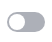

# 购买并添加域名证书监控

本章节指导用户购买并添加域名证书监控，通过对多个站点不同域名检测，实现统一维护多站点HTTPS，降低因人为疏忽导致HTTPS业务中断的风险。

## 购买域名证书监控服务

1.  登录[管理控制台](https://auth.huaweicloud.com/)。
2.  单击页面左上方的，选择“安全与合规  \>  云证书管理服务“，进入云证书管理界面。
3.  在左侧导航栏选择“SSL证书管理 \>域名证书监控“，进入域名证书监控界面。
4.  单击右上角“购买域名证书监控“进入域名证书监控购买页。
    -   **服务类型**：域名证书监控
    -   **规格**：支持购买5个域名、20个域名、100个域名和1000个域名
    -   **区域**：全区域可用
    -   **购买时长**：可选1年、2年和3年

5.  确定服务类型、规格和购买时长后单击“立即购买“。
6.  进入订单确认界面，勾选我已阅读并同意《云证书管理服务（CCM）免责声明》并单击“去支付“。
7.  完成支付后，域名证书监控服务即购买成功。

> **须知：** 
>-   购买域名证书监控服务后，在其有效期内仅支持升级域名证书监控规格，无法重复购买。如您当前购买的域名证书监控实例无法满足业务需求，您可以单击右上角“升级规格“，获取更多监控实例。
>-   域名证书监控服务当前仅支持**包年/包月**计费模式 ，实际费用以页面显示为准，更多计费规则请参见[计费说明](https://support.huaweicloud.com/price-ccm/ccm_01_0180.html)。

## 添加域名证书监控

1.  登录[管理控制台](https://auth.huaweicloud.com/)。
2.  单击页面左上方的，选择“安全与合规  \>  云证书管理服务“，进入云证书管理界面。
3.  在左侧导航栏选择“SSL证书管理 \>域名证书监控“，进入域名证书监控界面。
4.  单击“添加域名“，如[图 添加域名](#fig1668081518333)。

    **图 1**  添加域名  
    

5.  在弹出的“添加域名”对话框中根据提示配置参数，如[图 添加域名并配置参数](#fig13990162993817)所示，参数说明如[表 配置参数](#table114011276327)所示。

    **图 2**  添加域名并配置参数  
    

    **表 1**  配置参数

    
    <table><thead align="left"><tr id="row140182763218"><th class="cellrowborder" valign="top" width="50%" id="mcps1.2.3.1.1">
参数名称

    </th>
    <th class="cellrowborder" valign="top" width="50%" id="mcps1.2.3.1.2">
参数说明

    </th>
    </tr>
    </thead>
    <tbody><tr id="row512213232252"><td class="cellrowborder" valign="top" width="50%" headers="mcps1.2.3.1.1 ">
当前可监控

    </td>
    <td class="cellrowborder" valign="top" width="50%" headers="mcps1.2.3.1.2 ">
显示当前剩余监控实例数量，如需购买更多实例，请单击“前往扩容”

    </td>
    </tr>
    <tr id="row1140212712325"><td class="cellrowborder" valign="top" width="50%" headers="mcps1.2.3.1.1 ">
域名/IP

    </td>
    <td class="cellrowborder" valign="top" width="50%" headers="mcps1.2.3.1.2 ">
需要进行监控的域名地址或IP地址

    </td>
    </tr>
    <tr id="row1440262783213"><td class="cellrowborder" valign="top" width="50%" headers="mcps1.2.3.1.1 ">
端口

    </td>
    <td class="cellrowborder" valign="top" width="50%" headers="mcps1.2.3.1.2 ">
端口号，默认为443

    </td>
    </tr>
    <tr id="row1240282719328"><td class="cellrowborder" valign="top" width="50%" headers="mcps1.2.3.1.1 ">
开启监控

    </td>
    <td class="cellrowborder" valign="top" width="50%" headers="mcps1.2.3.1.2 "><ul id="ul86261772404"><li>单击开启“监控按钮”开启监控后，将对该域名所使用证书的状态和有效期进行持续的监控服务。</li><li>单击关闭开启“监控按钮”关闭监控后，该域名的状态和有效期将不会被监控。</li></ul>
    </td>
    </tr>
    </tbody>
    </table>

6.  配置完成后，单击“确定“完成添加域名监控。

