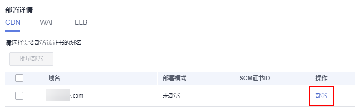
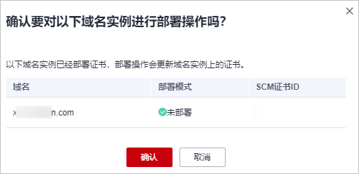

# 部署SSL证书到CDN

SSL证书签发后，您可以将国际标准SSL证书一键部署到华为云产品CDN（Content Delivery Network，内容分发网络）中。部署后，可以帮助您提升云产品CDN访问数据的安全性。

## 前提条件

-   已开通CDN（Content Delivery Network，内容分发网络），且已在CDN中配置了与SSL证书匹配的网站域名。

    如果没有购买CDN，或数字证书所绑定的域名没有在CDN中开通服务，请不要将数字证书部署到CDN中，若部署将可能导致部署失败。

-   已在云证书管理服务中申请SSL证书且状态为“已签发“，或者已将在其他平台签发的SSL证书上传至云证书管理服务中且状态为“托管中“。
-   证书为国际标准证书。

## 约束条件

-   申请证书时，如果“证书请求文件“选择的是“自己生成CSR“，那么签发的证书**不支持**一键部署到云产品。如需在对应云产品中使用证书，可以先将证书下载到本地，然后再到对应云产品中上传证书并进行部署。
-   部署至CDN加速域名，需要加速域名开启HTTPS，才能在部署证书功能中完成对该域名的部署。

## 操作步骤

1.  登录[管理控制台](https://console.huaweicloud.com/)。
2.  单击页面左上方的，选择“安全与合规  \>  云证书管理服务“，进入云证书管理界面。
3.  在左侧导航栏选择“SSL证书管理 \> SSL证书列表“，进入SSL证书列表页面。
4.  在目标证书所在行的“操作“列，单击“部署证书“，系统从右面弹出证书部署详细页面，如[图1](#ccm_01_0321_zh-cn_topic_0000001124217559_zh-cn_topic_0114377953_fig4429445388)所示。

    **图 1**  部署证书  
    

5.  在证书部署详情页面中的“部署详情“栏中，选择CDN。

    **图 2**  选择云产品  
    

6.  选择当前证书中需要部署的域名，并单击“操作“列的“部署“。

    如需部署多个域名，则从域名列表中选择所有待部署的域名，并单击列表左上角的“批量部署“。

    **图 3**  部署  
    

7.  在弹出的确认框中，确认无误后单击“确认“。

    **图 4**  部署证书提示信息  
    

    部署成功后，对应域名的“部署模式“刷新为“已部署“。

