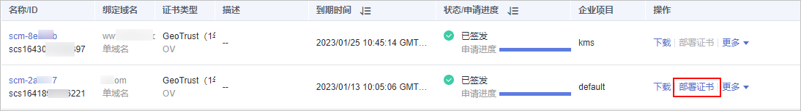
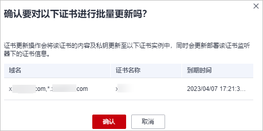

# 部署SSL证书到ELB

SSL证书签发后，您可以将国际标准SSL证书一键部署到华为云产品弹性负载均衡（Elastic Load Balance，ELB）中。部署后，可以帮助您提升云产品ELB访问数据的安全性。

## 前提条件

-   已开通以下弹性负载均衡（Elastic Load Balance，ELB），且已在ELB中配置了与SSL证书匹配的网站域名。

    如果没有购买ELB，或数字证书所绑定的域名没有在ELB中开通服务，请不要将数字证书部署到ELB中，若部署将可能导致部署失败。

-   已在云证书管理服务中申请SSL证书且状态为“已签发“，或者已将在其他平台签发的SSL证书上传至云证书管理服务中且状态为“托管中“。

## 约束条件

-   您已在ELB中配置过证书，即您需要先在ELB服务中完成**首次**证书的配置，才能通过SCM服务更新证书。ELB中创建证书详细操作请参见[创建证书](https://support.huaweicloud.com/usermanual-elb/elb_ug_zs_0004.html)。
-   通过SCM更新ELB中的证书，可以更新部署在ELB监听器下证书，即在SCM控制台更新对应ELB中证书的内容及私钥，更新成功后，ELB将自动对该证书部署的监听器实例完成证书内容及私钥的更新。
-   ELB中使用的证书，需要指定域名，才可在SCM中完成更新证书的操作。
-   ELB中使用的证书若指定了多个域名，更新证书前需要注意SCM证书的域名与其是否完全匹配。若不完全匹配，则在SCM中执行更新证书操作后，会同时将ELB中使用的证书域名更新为当前SCM中证书的域名。

    示例：SCM中证书的主域名及附加域名为example01.com，example02.com，ELB中证书的域名为example01.com，example03.com，在SCM中执行更新证书操作后，会将该ELB中证书的域名更新为example01.com，example02.com。

-   申请证书时，如果“证书请求文件“选择的是“自己生成CSR“，那么签发的证书**不支持**一键部署到云产品。如需在对应云产品中使用证书，可以先将证书下载到本地，然后再到对应云产品中上传证书并进行部署。
-   国密证书暂不支持一键部署到华为云其他云产品。

## 操作步骤

1.  登录[管理控制台](https://console.huaweicloud.com/)。
2.  单击页面左上方的，选择“安全与合规  \>  云证书管理服务“，进入云证书管理界面。
3.  在左侧导航栏选择“SSL证书管理 \> SSL证书列表“，进入SSL证书列表页面。
4.  在目标证书所在行的“操作“列，单击“部署证书“，系统从右面弹出证书部署详细页面，如[图1](#ccm_01_0321_zh-cn_topic_0000001124217559_zh-cn_topic_0114377953_fig4429445388)所示。

    **图 1**  部署证书  
    

5.  在证书部署详情页面中的“部署详情“栏中，选择ELB。

    **图 2**  选择云产品  
    

6.  单击区域名称右侧的，选择部署的区域。
7.  选择当前证书中需要部署的域名，并单击“操作“列的“更新证书“。

    如需更新多个域名，则从域名列表中选择所有待更新的域名，并单击列表左上角的“批量更新“。

    **图 3**  更新证书  
    

8.  在弹出的确认框中，确认无误后单击“确认“。

    **图 4**  更新证书提示信息  
    

    页面出现证书更新成功提示，表示SSL证书更新至ELB服务成功。

