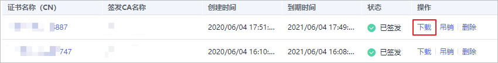

# 下载私有证书

私有证书申请后，您可以将私有证书下载到本地。证书下载后，才可以分配给对应的证书主体进行安装使用。

本章节介绍如何下载私有证书，只有证书状态为“已签发“时，才可以下载。

## 前提条件

已申请私有证书并私有证书的状态为“已签发“，详细操作请参见[申请私有证书](申请私有证书.md)。

## 操作步骤

1.  登录[管理控制台](https://console.huaweicloud.com/)。
2.  单击页面左上方的，选择“安全与合规  \>  云证书管理服务“，并在左侧导航栏选择“私有证书管理  \>  私有证书“进入私有证书管理界面。
3.  在需要下载的私有证书所在行的“操作“列，单击下载。

    **图 1**  下载私有证书  
    

4.  请根据您需要的服务器类型，在对应的“页面“单击“下载证书“，进行私有证书下载操作。

    执行操作后，私有证书管理服务将使用浏览器自带的下载工具，将私有证书文件下载至本地指定的位置。

## 私有证书安装说明

私有证书下载后需要安装到服务器上进行使用，非国密证书的安装操作与国际标准SSL证书安装操作相同，您可以参考[表 安装SSL证书操作示例](#table1950961447)。

**表 1**  安装SSL证书操作示例

<table><thead align="left"><tr id="row69517614419"><th class="cellrowborder" valign="top" width="31.080000000000002%" id="mcps1.2.3.1.1">
服务器类型

</th>
<th class="cellrowborder" valign="top" width="68.92%" id="mcps1.2.3.1.2">
操作示例

</th>
</tr>
</thead>
<tbody><tr id="row1995176744"><td class="cellrowborder" valign="top" width="31.080000000000002%" headers="mcps1.2.3.1.1 ">
Tomcat

</td>
<td class="cellrowborder" valign="top" width="68.92%" headers="mcps1.2.3.1.2 ">
<a href="https://support.huaweicloud.com/usermanual-ccm/ccm_01_0081.html" target="_blank" rel="noopener noreferrer">在Tomcat服务器上安装SSL证书</a>

</td>
</tr>
<tr id="row16951369410"><td class="cellrowborder" valign="top" width="31.080000000000002%" headers="mcps1.2.3.1.1 ">
Nginx

</td>
<td class="cellrowborder" valign="top" width="68.92%" headers="mcps1.2.3.1.2 ">
<a href="https://support.huaweicloud.com/usermanual-ccm/ccm_01_0082.html" target="_blank" rel="noopener noreferrer">在Nginx服务器上安装SSL证书</a>

</td>
</tr>
<tr id="row12951265420"><td class="cellrowborder" valign="top" width="31.080000000000002%" headers="mcps1.2.3.1.1 ">
Apache

</td>
<td class="cellrowborder" valign="top" width="68.92%" headers="mcps1.2.3.1.2 ">
<a href="https://support.huaweicloud.com/usermanual-ccm/ccm_01_0083.html" target="_blank" rel="noopener noreferrer">在Apache服务器上安装SSL证书</a>

</td>
</tr>
<tr id="row10951661849"><td class="cellrowborder" valign="top" width="31.080000000000002%" headers="mcps1.2.3.1.1 ">
IIS

</td>
<td class="cellrowborder" valign="top" width="68.92%" headers="mcps1.2.3.1.2 ">
<a href="https://support.huaweicloud.com/usermanual-ccm/ccm_01_0084.html" target="_blank" rel="noopener noreferrer">在IIS服务器上安装SSL证书</a>

</td>
</tr>
<tr id="row4951561644"><td class="cellrowborder" valign="top" width="31.080000000000002%" headers="mcps1.2.3.1.1 ">
Weblogic

</td>
<td class="cellrowborder" valign="top" width="68.92%" headers="mcps1.2.3.1.2 ">
<a href="https://support.huaweicloud.com/usermanual-ccm/ccm_01_0125.html" target="_blank" rel="noopener noreferrer">在Weblogic服务器上安装SSL证书</a>

</td>
</tr>
<tr id="row8896618179"><td class="cellrowborder" valign="top" width="31.080000000000002%" headers="mcps1.2.3.1.1 ">
Resin

</td>
<td class="cellrowborder" valign="top" width="68.92%" headers="mcps1.2.3.1.2 ">
<a href="https://support.huaweicloud.com/usermanual-ccm/ccm_01_0070.html" target="_blank" rel="noopener noreferrer">在Resin服务器上安装SSL证书</a>

</td>
</tr>
</tbody>
</table>

## 下载的证书文件说明

根据申请私有证书时，选择的“证书请求文件“方式（“系统生成文件“和“自己生成文件“）的不同，下载文件也有所不同。

-   系统生成文件

    申请私有证书时，如果“证书请求文件“选择的是“系统生成文件“，则下载文件说明如[表2](#zh-cn_topic_0000001124401641_table2060654743315)所示。

    **表 2**  下载文件说明（一）

    
    <table><thead align="left"><tr id="zh-cn_topic_0000001124401641_row146071647173314"><th class="cellrowborder" valign="top" width="19.96%" id="mcps1.2.4.1.1">
证书类型

    </th>
    <th class="cellrowborder" valign="top" width="24.709999999999997%" id="mcps1.2.4.1.2">
服务器类型

    </th>
    <th class="cellrowborder" valign="top" width="55.33%" id="mcps1.2.4.1.3">
zip压缩包中包含的文件

    </th>
    </tr>
    </thead>
    <tbody><tr id="zh-cn_topic_0000001124401641_row198741484419"><td class="cellrowborder" rowspan="5" valign="top" width="19.96%" headers="mcps1.2.4.1.1 ">
国际证书

    </td>
    <td class="cellrowborder" valign="top" width="24.709999999999997%" headers="mcps1.2.4.1.2 ">
Tomcat

    </td>
    <td class="cellrowborder" valign="top" width="55.33%" headers="mcps1.2.4.1.3 ">
keystorePass.txt：证书密码。

    
server.jks：证书文件。

    </td>
    </tr>
    <tr id="zh-cn_topic_0000001124401641_row712014144116"><td class="cellrowborder" valign="top" headers="mcps1.2.4.1.1 ">
Nginx

    </td>
    <td class="cellrowborder" valign="top" headers="mcps1.2.4.1.2 ">
server.crt：证书文件，分别为服务器证书和证书链。

    
server.key：证书私钥文件。

    </td>
    </tr>
    <tr id="zh-cn_topic_0000001124401641_row12527181144115"><td class="cellrowborder" valign="top" headers="mcps1.2.4.1.1 ">
Apache

    </td>
    <td class="cellrowborder" valign="top" headers="mcps1.2.4.1.2 ">
chain.crt：证书链文件。

    
server.crt：证书文件。

    
server.key：证书私钥文件。

    </td>
    </tr>
    <tr id="zh-cn_topic_0000001124401641_row1425135912401"><td class="cellrowborder" valign="top" headers="mcps1.2.4.1.1 ">
IIS

    </td>
    <td class="cellrowborder" valign="top" headers="mcps1.2.4.1.2 ">
keystorePass.txt：证书密码。

    
server.pfx：证书文件。

    </td>
    </tr>
    <tr id="zh-cn_topic_0000001124401641_row186081472334"><td class="cellrowborder" valign="top" headers="mcps1.2.4.1.1 ">
其他

    </td>
    <td class="cellrowborder" valign="top" headers="mcps1.2.4.1.2 ">
chain.pem：证书链文件。

    
server.key：证书私钥文件。

    
server.pem：证书文件。

    </td>
    </tr>
    <tr id="row75501931202411"><td class="cellrowborder" valign="top" width="19.96%" headers="mcps1.2.4.1.1 ">
国密SM2证书

    </td>
    <td class="cellrowborder" valign="top" width="24.709999999999997%" headers="mcps1.2.4.1.2 ">
其他

    </td>
    <td class="cellrowborder" valign="top" width="55.33%" headers="mcps1.2.4.1.3 ">
是否导出国密GMT 0009-2012标准规范的SM2数字信封：

    <ul id="ul38681249143617"><li>是，zip压缩包中包含的文件为：
chain.pem ：证书链文件

    
encSm2EnvelopedKey.key ：国密SM2数字信封

    
encCert.pem：加密证书文件

    
signCert.key：签名证书私钥文件

    
signCert.pem：签名证书文件

    </li><li>否，zip压缩包中包含的文件为：
chain.pem ：证书链文件

    
encCert.key ：加密证书私钥

    
encCert.pem：加密证书文件

    
signCert.key：签名证书私钥文件

    
signCert.pem：签名证书文件

    </li></ul>
    </td>
    </tr>
    </tbody>
    </table>

-   自己生成文件

    申请私有证书时，如果“证书请求文件“选择的是“自己生成文件“，则下载文件说明如[表3](#zh-cn_topic_0000001124401641_table38979223371)所示。

    **表 3**  下载文件说明（二）

    
    <table><thead align="left"><tr id="zh-cn_topic_0000001124401641_row20897112217371"><th class="cellrowborder" valign="top" width="20.810000000000002%" id="mcps1.2.4.1.1">
证书类型

    </th>
    <th class="cellrowborder" valign="top" width="24.47%" id="mcps1.2.4.1.2">
服务器类型

    </th>
    <th class="cellrowborder" valign="top" width="54.72%" id="mcps1.2.4.1.3">
zip压缩包中包含的文件

    </th>
    </tr>
    </thead>
    <tbody><tr id="zh-cn_topic_0000001124401641_row106495391422"><td class="cellrowborder" rowspan="5" valign="top" width="20.810000000000002%" headers="mcps1.2.4.1.1 ">
国际证书

    </td>
    <td class="cellrowborder" valign="top" width="24.47%" headers="mcps1.2.4.1.2 ">
Tomcat

    </td>
    <td class="cellrowborder" valign="top" width="54.72%" headers="mcps1.2.4.1.3 ">
server.crt：证书文件。

    
chain.crt：证书链文件。

    </td>
    </tr>
    <tr id="zh-cn_topic_0000001124401641_row0435153744218"><td class="cellrowborder" valign="top" headers="mcps1.2.4.1.1 ">
Nginx

    </td>
    <td class="cellrowborder" valign="top" headers="mcps1.2.4.1.2 ">
server.crt：证书文件

    </td>
    </tr>
    <tr id="zh-cn_topic_0000001124401641_row18373163504213"><td class="cellrowborder" valign="top" headers="mcps1.2.4.1.1 ">
Apache

    </td>
    <td class="cellrowborder" valign="top" headers="mcps1.2.4.1.2 ">
server.crt：证书文件。

    
chain.crt：证书链文件。

    </td>
    </tr>
    <tr id="zh-cn_topic_0000001124401641_row9123113316424"><td class="cellrowborder" valign="top" headers="mcps1.2.4.1.1 ">
IIS

    </td>
    <td class="cellrowborder" valign="top" headers="mcps1.2.4.1.2 ">
server.crt：证书文件。

    
chain.crt：证书链文件。

    </td>
    </tr>
    <tr id="zh-cn_topic_0000001124401641_row10899202223711"><td class="cellrowborder" valign="top" headers="mcps1.2.4.1.1 ">
其他

    </td>
    <td class="cellrowborder" valign="top" headers="mcps1.2.4.1.2 ">
cert.pem：证书文件。

    
chain.pem：证书链文件。

    </td>
    </tr>
    <tr id="row15228726152210"><td class="cellrowborder" valign="top" width="20.810000000000002%" headers="mcps1.2.4.1.1 ">
国密SM2证书

    </td>
    <td class="cellrowborder" valign="top" width="24.47%" headers="mcps1.2.4.1.2 ">
其他

    </td>
    <td class="cellrowborder" valign="top" width="54.72%" headers="mcps1.2.4.1.3 ">
是否导出国密GMT 0009-2012标准规范的SM2数字信封：

    <ul id="ul117061930173318"><li>是，zip压缩包中包含的文件为：
chain.pem ：证书链文件

    
encSm2EnvelopedKey.key ：国密SM2数字信封

    
encCert.pem：加密证书文件

    
signCert.pem：签名证书文件

    </li><li>否，zip压缩包中包含的文件为：
chain.pem ：证书链文件

    
encCert.key ：加密证书私钥文件

    
encCert.pem：加密证书文件

    
signCert.pem：签名证书文件

    </li></ul>
    </td>
    </tr>
    </tbody>
    </table>

