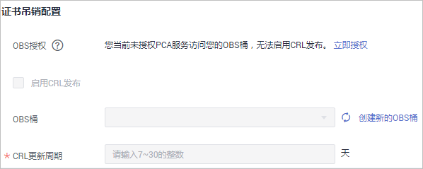

# 创建私有CA

华为云云证书管理服务提供有PCA服务，可以帮助您通过简单的可视化操作，以低投入的方式创建企业内部CA并使用它签发证书。

本章节帮助您通过云证书管理控制台创建私有CA（支持创建根CA和从属CA）。

## 背景信息

-   私有CA分为根CA和从属CA（即中间CA或子CA），从属CA隶属于根CA，根CA下可以包含多个从属CA。
-   首次创建私有CA时，须先创建根CA。
-   每个用户可以创建100个CA，已计划删除的私有CA也将计入CA限制值内，直到计划删除CA执行删除为止。

## 前提条件

创建私有CA的帐号拥有“PCA FullAccess“权限。

## 操作步骤

1.  登录[管理控制台](https://console.huaweicloud.com/)。
2.  单击页面左上方的，选择“安全与合规  \>  云证书管理服务“，并在左侧导航栏选择“私有证书管理  \>  私有CA“进入私有CA管理界面。
3.  在私有CA列表右上角，单击“创建CA“，进入创建CA界面。
4.  配置私有CA信息。

    您需要配置“基本信息“、“证书唯一标识名称（DN）“、“企业项目“和“证书吊销配置“信息。

    1.  配置基本信息，如[\#ccm\_01\_0016/zh-cn\_topic\_0000001124217631\_fig19641142713913](#zh-cn_topic_0000001124217631_fig19641142713913)所示，参数说明如[表1](#zh-cn_topic_0000001124217631_table1577194719541)所示。

        

        **表 1**  基本信息参数说明

        
        <table><thead align="left"><tr id="zh-cn_topic_0000001124217631_row1578447205416"><th class="cellrowborder" valign="top" width="25%" id="mcps1.2.4.1.1">
参数名称

        </th>
        <th class="cellrowborder" valign="top" width="53.14%" id="mcps1.2.4.1.2">
参数说明

        </th>
        <th class="cellrowborder" valign="top" width="21.86%" id="mcps1.2.4.1.3">
取值样例

        </th>
        </tr>
        </thead>
        <tbody><tr id="zh-cn_topic_0000001124217631_row17864719549"><td class="cellrowborder" valign="top" width="25%" headers="mcps1.2.4.1.1 ">
CA类型

        </td>
        <td class="cellrowborder" valign="top" width="53.14%" headers="mcps1.2.4.1.2 ">
选择待创建的私有证书颁发机构的类型。

        
CA类型：

        <ul id="zh-cn_topic_0000001124217631_ul1015222311814"><li>根CA：如果要建立新的CA层次结构，则选择此项。
 说明： 

首次创建私有CA，则须创建根CA。

        

        </li><li>从属CA：用于在现有的CA层次结构中增加新的层次。</li></ul>
        </td>
        <td class="cellrowborder" valign="top" width="21.86%" headers="mcps1.2.4.1.3 ">
根CA

        </td>
        </tr>
        <tr id="zh-cn_topic_0000001124217631_row37934714541"><td class="cellrowborder" valign="top" width="25%" headers="mcps1.2.4.1.1 ">
密钥算法

        </td>
        <td class="cellrowborder" valign="top" width="53.14%" headers="mcps1.2.4.1.2 ">
选择密钥算法和密钥的位大小。

        <ul id="zh-cn_topic_0000001124217631_ul24361567148"><li>RSA2048</li><li>RSA4096</li><li>EC256</li><li>EC384</li><li>SM2</li></ul>
        </td>
        <td class="cellrowborder" valign="top" width="21.86%" headers="mcps1.2.4.1.3 ">
RSA2048

        </td>
        </tr>
        <tr id="zh-cn_topic_0000001124217631_row20796476545"><td class="cellrowborder" valign="top" width="25%" headers="mcps1.2.4.1.1 ">
签名哈希算法

        </td>
        <td class="cellrowborder" valign="top" width="53.14%" headers="mcps1.2.4.1.2 ">
“CA类型”选择“根CA”时，显示该参数。

        
当“密钥算法”选择“SM2”时，签名哈希算法默认为“SM3”无需进行选择。

        
当密钥算法选择非SM2时，可选择签名哈希算法：

        <ul id="zh-cn_topic_0000001124217631_ul716162091715"><li>SHA256</li><li>SHA384</li><li>SHA512</li></ul>
        </td>
        <td class="cellrowborder" valign="top" width="21.86%" headers="mcps1.2.4.1.3 ">
SHA256

        </td>
        </tr>
        <tr id="zh-cn_topic_0000001124217631_row2791475548"><td class="cellrowborder" valign="top" width="25%" headers="mcps1.2.4.1.1 ">
有效期

        </td>
        <td class="cellrowborder" valign="top" width="53.14%" headers="mcps1.2.4.1.2 ">
“CA类型”选择“根CA”时，显示该参数。

        
选择私有证书颁发机构有效期，可选择最长有效期为30年。

        </td>
        <td class="cellrowborder" valign="top" width="21.86%" headers="mcps1.2.4.1.3 ">
3年

        </td>
        </tr>
        </tbody>
        </table>

    2.  配置证书唯一标识名称（Distinguished Name，DN）信息，如[图1](#zh-cn_topic_0000001124217631_fig78301415114014)所示，参数说明如[表2](#zh-cn_topic_0000001124217631_table104346261582)所示。

        **图 1**  DN信息  
        

        **表 2**  DN信息参数说明

        
        <table><thead align="left"><tr id="zh-cn_topic_0000001124217631_row15434172611587"><th class="cellrowborder" valign="top" width="24.97%" id="mcps1.2.4.1.1">
参数名称

        </th>
        <th class="cellrowborder" valign="top" width="49.66%" id="mcps1.2.4.1.2">
参数说明

        </th>
        <th class="cellrowborder" valign="top" width="25.369999999999997%" id="mcps1.2.4.1.3">
取值样例

        </th>
        </tr>
        </thead>
        <tbody><tr id="zh-cn_topic_0000001124217631_row03895345512"><td class="cellrowborder" valign="top" width="24.97%" headers="mcps1.2.4.1.1 ">
CA名称（CN）

        </td>
        <td class="cellrowborder" valign="top" width="49.66%" headers="mcps1.2.4.1.2 ">
自定义私有CA名称。

        </td>
        <td class="cellrowborder" valign="top" width="25.369999999999997%" headers="mcps1.2.4.1.3 ">
-

        </td>
        </tr>
        <tr id="zh-cn_topic_0000001124217631_row09164369351"><td class="cellrowborder" valign="top" width="24.97%" headers="mcps1.2.4.1.1 ">
国家/地区

        </td>
        <td class="cellrowborder" valign="top" width="49.66%" headers="mcps1.2.4.1.2 ">
申请单位所属国家或地区，只能是两个字母的国家或地区代码。

        </td>
        <td class="cellrowborder" valign="top" width="25.369999999999997%" headers="mcps1.2.4.1.3 ">
CN

        </td>
        </tr>
        <tr id="zh-cn_topic_0000001124217631_row061084693511"><td class="cellrowborder" valign="top" width="24.97%" headers="mcps1.2.4.1.1 ">
省/市

        </td>
        <td class="cellrowborder" valign="top" width="49.66%" headers="mcps1.2.4.1.2 ">
申请单位所在省名或市名，可以是中文或英文。

        </td>
        <td class="cellrowborder" valign="top" width="25.369999999999997%" headers="mcps1.2.4.1.3 ">
ShenZhen

        </td>
        </tr>
        <tr id="zh-cn_topic_0000001124217631_row204931546358"><td class="cellrowborder" valign="top" width="24.97%" headers="mcps1.2.4.1.1 ">
城市

        </td>
        <td class="cellrowborder" valign="top" width="49.66%" headers="mcps1.2.4.1.2 ">
申请单位所在城市名，可以是中文或英文。

        </td>
        <td class="cellrowborder" valign="top" width="25.369999999999997%" headers="mcps1.2.4.1.3 ">
GuangZhou

        </td>
        </tr>
        <tr id="zh-cn_topic_0000001124217631_row933710614365"><td class="cellrowborder" valign="top" width="24.97%" headers="mcps1.2.4.1.1 ">
公司名称（O）

        </td>
        <td class="cellrowborder" valign="top" width="49.66%" headers="mcps1.2.4.1.2 ">
申请单位法定名称，可以是中文或英文。

        </td>
        <td class="cellrowborder" valign="top" width="25.369999999999997%" headers="mcps1.2.4.1.3 ">
-

        </td>
        </tr>
        <tr id="zh-cn_topic_0000001124217631_row1875961318366"><td class="cellrowborder" valign="top" width="24.97%" headers="mcps1.2.4.1.1 ">
部门名称（OU）

        </td>
        <td class="cellrowborder" valign="top" width="49.66%" headers="mcps1.2.4.1.2 ">
申请单位的所在部门，可以是中文或英文。

        </td>
        <td class="cellrowborder" valign="top" width="25.369999999999997%" headers="mcps1.2.4.1.3 ">
Cloud Dept.

        </td>
        </tr>
        </tbody>
        </table>

    3.  （可选）在“企业项目“下拉列表中选择您所在的企业项目。

        企业项目针对企业用户使用，只有开通了企业项目的客户，或者权限为企业主帐号的客户才可见。

        如需使用该功能，请[开通企业管理功能](https://support.huaweicloud.com/usermanual-em/em_am_0008.html)。企业项目是一种云资源管理方式，企业项目管理服务提供统一的云资源按项目管理，以及项目内的资源管理、成员管理。

        > **说明：** 
        >“default“为默认企业项目，帐号下原有资源和未选择企业项目的资源均在默认企业项目内。

    4.  （可选）配置证书吊销信息。

        如果需要PCA为私有CA吊销的证书发布证书吊销列表（Certificate Revocation List，CRL），则可配置证书吊销信息。

        若无需配置，请直接跳过该步骤。

        配置证书吊销信息，如[图2](#zh-cn_topic_0000001124217631_fig1912819018456)所示，参数说明如[表3](#zh-cn_topic_0000001124217631_table9948417509)所示。

        **图 2**  证书吊销  
        

        **表 3**  证书吊销参数说明

        
        <table><thead align="left"><tr id="zh-cn_topic_0000001124217631_row99463120502"><th class="cellrowborder" valign="top" width="33.33%" id="mcps1.2.3.1.1">
参数名称

        </th>
        <th class="cellrowborder" valign="top" width="66.67%" id="mcps1.2.3.1.2">
参数说明

        </th>
        </tr>
        </thead>
        <tbody><tr id="zh-cn_topic_0000001124217631_row1271693910366"><td class="cellrowborder" valign="top" width="33.33%" headers="mcps1.2.3.1.1 ">
OBS授权

        </td>
        <td class="cellrowborder" valign="top" width="66.67%" headers="mcps1.2.3.1.2 ">
确认是否授权PCA服务访问您的OBS桶并上传CRL文件。

        
若确认授权，则单击“立即授权”，并根据提示完成授权。

        
授权成功后，取消授权需要到统一身份认证服务控制台委托服务列表中删除委托。

        
若已授权，则无需再次授权。

        </td>
        </tr>
        <tr id="zh-cn_topic_0000001124217631_row199477114502"><td class="cellrowborder" valign="top" width="33.33%" headers="mcps1.2.3.1.1 ">
启用CRL发布

        </td>
        <td class="cellrowborder" valign="top" width="66.67%" headers="mcps1.2.3.1.2 ">
确认是否启用CRL发布。

        </td>
        </tr>
        <tr id="zh-cn_topic_0000001124217631_row109471614503"><td class="cellrowborder" valign="top" width="33.33%" headers="mcps1.2.3.1.1 ">
OBS桶

        </td>
        <td class="cellrowborder" valign="top" width="66.67%" headers="mcps1.2.3.1.2 ">
选择已有的OBS桶，或单击“创建新的OBS桶”来创建新的OBS桶。

        </td>
        </tr>
        <tr id="zh-cn_topic_0000001124217631_row694814195018"><td class="cellrowborder" valign="top" width="33.33%" headers="mcps1.2.3.1.1 ">
CRL更新周期

        </td>
        <td class="cellrowborder" valign="top" width="66.67%" headers="mcps1.2.3.1.2 ">
CRL更新的周期。私有证书管理服务将在指定时间内重新生成CRL。

        
可设置为7~30的整数更新天数，如果未设置则默认为7天。

        </td>
        </tr>
        </tbody>
        </table>

5.  单击“下一步“，进入确认信息页面。
6.  确认信息以及价格无误后，单击“确认并创建“，完成创建私有CA操作。

    若创建的是**根CA**，则创建后便已激活；若创建的为从属CA，则需要进行激活操作。

    私有**从属CA**创建后，如需立即安装CA证书并激活CA，则单击“立即激活“；如需后续再激活，单击“稍后再激活“。

## 后续处理

私有**根CA**创建成功后，即可用于签发私有证书，申请私有证书详细操作请参见[申请私有证书](申请私有证书.md)。

私有**从属CA**创建成功后，需要安装证书并激活CA，具体操作请参见[激活私有CA](激活私有CA.md)。

