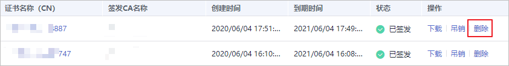
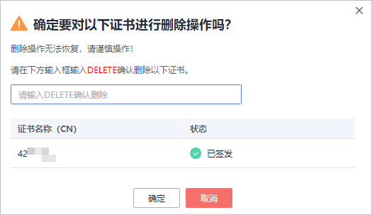

# 删除私有证书

删除证书是指将证书资源从华为云系统中删除。证书仍然有效，浏览器仍然信任该证书。

如果您要删除不再需要的证书，请参照本章节进行处理。

## 前提条件

证书状态为“已到期“、“已签发“或“已吊销“。

## 约束条件

-   证书删除后将无法恢复，请谨慎操作。
-   删除证书申请提交后，将无法取消，请谨慎操作。

## 操作步骤

1.  登录[管理控制台](https://console.huaweicloud.com/)。
2.  单击页面左上方的，选择“安全与合规  \>  云证书管理服务“，并在左侧导航栏选择“私有证书管理  \>  私有证书“进入私有证书管理界面。
3.  在需要删除的私有证书所在行的“操作“列，单击“删除“。

    **图 1**  删除私有证书  
    

4.  在弹出的对话框中输入“DELETE“，以确认删除证书信息。

    **图 2**  删除私有证书提示信息  
    

5.  单击“确定“，页面右上角弹出“删除证书xxx成功！“，则说明删除成功。

