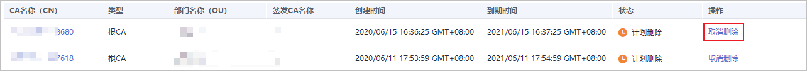

# 取消删除私有CA

本章节介绍在未超出删除私有CA的推迟时间，对私有CA进行取消删除操作，取消删除后私有CA处于“已禁用“状态。

## 前提条件

待取消删除的私有CA需处于“计划删除“状态。

## 操作步骤

1.  登录[管理控制台](https://console.huaweicloud.com/)。
2.  单击页面左上方的，选择“安全与合规  \>  云证书管理服务“，并在左侧导航栏选择“私有证书管理  \>  私有CA“进入私有CA管理界面。
3.  在需要取消删除的私有CA所在行的“操作“列，单击“取消删除“。

    **图 1**  取消删除私有CA  
    

4.  在弹出的对话框中，单击“确定“，完成取消删除私有CA操作。

    当页面右上角弹出“取消删除CA xxx 成功！“，且私有CA状态为“已禁用“，则说明取消删除私有CA操作成功。

    取消删除后，如需使用该私有CA签发证书，还需要将其启用，详细操作请参见[启用私有CA](启用私有CA.md)。

