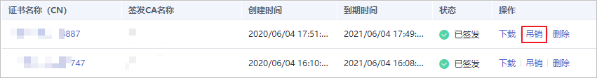
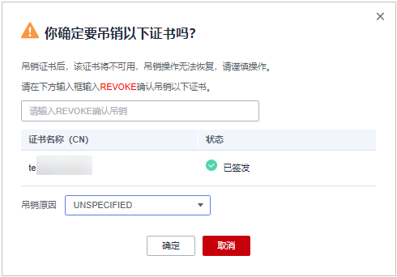

# 吊销私有证书

私有证书到期前，如果您不再需要使用该证书或者该私有证书私钥丢失，可以通过云证书管理控制台吊销该证书。私有证书吊销后，将不再被组织内部环境所信任。

私有证书吊销后，将不再继续计费。

本章节介绍吊销私有证书的操作步骤。

## 前提条件

私有证书的状态为“已签发“。

## 约束条件

-   吊销私有证书申请提交后，将无法取消，请谨慎操作。
-   吊销证书后，将清除该证书所有的记录，包括私有CA的记录，且无法恢复，请谨慎操作。

## 操作步骤

1.  登录[管理控制台](https://console.huaweicloud.com/)。
2.  单击页面左上方的，选择“安全与合规  \>  云证书管理服务“，并在左侧导航栏选择“私有证书管理  \>  私有证书“进入私有证书管理界面。
3.  在需要吊销的私有证书所在行的“操作“列，单击“吊销“。

    **图 1**  吊销私有证书  
    

4.  在弹出的对话框中，输入“REVOKE“，并选择吊销原因，以确认吊销证书信息。默认的吊销原因为“UNSPECIFIED“，吊销原因可选值及其含义如[表 吊销理由及含义](#table1492612115112)所示。

    **图 2**  吊销私有证书提示信息  
    

    **表 1**  吊销原因及含义

    
    <table><thead align="left"><tr id="zh-cn_topic_0000001304495373_row6599356193618"><th class="cellrowborder" valign="top" width="33.33333333333333%" id="mcps1.2.4.1.1">
吊销理由

    </th>
    <th class="cellrowborder" valign="top" width="33.33333333333333%" id="mcps1.2.4.1.2">
对应RFC 5280标准中的吊销理由码

    </th>
    <th class="cellrowborder" valign="top" width="33.33333333333333%" id="mcps1.2.4.1.3">
含义

    </th>
    </tr>
    </thead>
    <tbody><tr id="zh-cn_topic_0000001304495373_row14599205618364"><td class="cellrowborder" valign="top" width="33.33333333333333%" headers="mcps1.2.4.1.1 ">
UNSPECIFIED

    </td>
    <td class="cellrowborder" valign="top" width="33.33333333333333%" headers="mcps1.2.4.1.2 ">
0

    </td>
    <td class="cellrowborder" valign="top" width="33.33333333333333%" headers="mcps1.2.4.1.3 ">
吊销时未指定吊销原因，为默认值

    </td>
    </tr>
    <tr id="zh-cn_topic_0000001304495373_row15599756103613"><td class="cellrowborder" valign="top" width="33.33333333333333%" headers="mcps1.2.4.1.1 ">
KEY_COMPROMISE

    </td>
    <td class="cellrowborder" valign="top" width="33.33333333333333%" headers="mcps1.2.4.1.2 ">
1

    </td>
    <td class="cellrowborder" valign="top" width="33.33333333333333%" headers="mcps1.2.4.1.3 ">
证书密钥材料泄露

    </td>
    </tr>
    <tr id="zh-cn_topic_0000001304495373_row4599256193612"><td class="cellrowborder" valign="top" width="33.33333333333333%" headers="mcps1.2.4.1.1 ">
CERTIFICATE_AUTHORITY_COMPROMISE

    </td>
    <td class="cellrowborder" valign="top" width="33.33333333333333%" headers="mcps1.2.4.1.2 ">
2

    </td>
    <td class="cellrowborder" valign="top" width="33.33333333333333%" headers="mcps1.2.4.1.3 ">
签发路径上，存在CA密钥材料泄露

    </td>
    </tr>
    <tr id="zh-cn_topic_0000001304495373_row125992056173619"><td class="cellrowborder" valign="top" width="33.33333333333333%" headers="mcps1.2.4.1.1 ">
AFFILIATION_CHANGED

    </td>
    <td class="cellrowborder" valign="top" width="33.33333333333333%" headers="mcps1.2.4.1.2 ">
3

    </td>
    <td class="cellrowborder" valign="top" width="33.33333333333333%" headers="mcps1.2.4.1.3 ">
证书中的主体或其他信息已经被改变

    </td>
    </tr>
    <tr id="zh-cn_topic_0000001304495373_row15599145673618"><td class="cellrowborder" valign="top" width="33.33333333333333%" headers="mcps1.2.4.1.1 ">
SUPERSEDED

    </td>
    <td class="cellrowborder" valign="top" width="33.33333333333333%" headers="mcps1.2.4.1.2 ">
4

    </td>
    <td class="cellrowborder" valign="top" width="33.33333333333333%" headers="mcps1.2.4.1.3 ">
证书已被取代

    </td>
    </tr>
    <tr id="zh-cn_topic_0000001304495373_row7600145613617"><td class="cellrowborder" valign="top" width="33.33333333333333%" headers="mcps1.2.4.1.1 ">
CESSATION_OF_OPERATION

    </td>
    <td class="cellrowborder" valign="top" width="33.33333333333333%" headers="mcps1.2.4.1.2 ">
5

    </td>
    <td class="cellrowborder" valign="top" width="33.33333333333333%" headers="mcps1.2.4.1.3 ">
证书或签发路径中的实体已停止运营

    </td>
    </tr>
    <tr id="zh-cn_topic_0000001304495373_row176004561367"><td class="cellrowborder" valign="top" width="33.33333333333333%" headers="mcps1.2.4.1.1 ">
CERTIFICATE_HOLD

    </td>
    <td class="cellrowborder" valign="top" width="33.33333333333333%" headers="mcps1.2.4.1.2 ">
6

    </td>
    <td class="cellrowborder" valign="top" width="33.33333333333333%" headers="mcps1.2.4.1.3 ">
证书当前不应被视为有效，将来可能会生效

    </td>
    </tr>
    <tr id="zh-cn_topic_0000001304495373_row1260095603616"><td class="cellrowborder" valign="top" width="33.33333333333333%" headers="mcps1.2.4.1.1 ">
PRIVILEGE_WITHDRAWN

    </td>
    <td class="cellrowborder" valign="top" width="33.33333333333333%" headers="mcps1.2.4.1.2 ">
9

    </td>
    <td class="cellrowborder" valign="top" width="33.33333333333333%" headers="mcps1.2.4.1.3 ">
证书不再有权声明其列出的属性

    </td>
    </tr>
    <tr id="zh-cn_topic_0000001304495373_row126001856103611"><td class="cellrowborder" valign="top" width="33.33333333333333%" headers="mcps1.2.4.1.1 ">
ATTRIBUTE_AUTHORITY_COMPROMISE

    </td>
    <td class="cellrowborder" valign="top" width="33.33333333333333%" headers="mcps1.2.4.1.2 ">
10

    </td>
    <td class="cellrowborder" valign="top" width="33.33333333333333%" headers="mcps1.2.4.1.3 ">
担保证书属性的机构可能已受到损害

    </td>
    </tr>
    </tbody>
    </table>

5.  单击“确定“。

    当页面右上角弹出“吊销证书xxx成功！“，且私有证书状态将更新为“已吊销“，则说明吊销成功。

