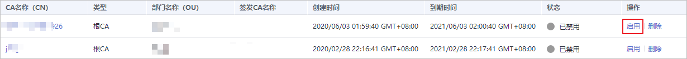

# 启用私有CA

如果您需要使用某个已禁用的私有CA来签发证书，可以将该证书恢复到已激活转态。

本章节介绍启用私有CA，使被禁用的私有CA恢复到已激活或已过期状态。

## 前提条件

待启用的私有CA需处于“已禁用“状态。禁用私有CA详细操作请参见[禁用私有CA](禁用私有CA.md)。

## 操作步骤

1.  登录[管理控制台](https://console.huaweicloud.com/)。
2.  单击页面左上方的，选择“安全与合规  \>  云证书管理服务“，并在左侧导航栏选择“私有证书管理  \>  私有CA“进入私有CA管理界面。
3.  在需要启用的私有CA所在行的“操作“列，单击“启用“。

    **图 1**  启用私有CA  
    

    当页面右上角弹出“启用CA xxx 成功！“，且私有CA状态更新为“已激活“，则说明启用私有CA操作成功。

