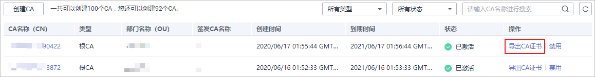

# 导出私有CA证书

私有CA创建并激活后，您可以导出私有CA证书。

如果您的业务用户通过浏览器访问您的Web业务，您需要将根证书加入您的浏览器信任列表中，并且在您的Web服务器安装经该根CA签发的私有证书，即可实现客户端与服务端的HTTPS通信。

如果您的业务用户通过Java等客户端访问您的Web业务，您需要在对应客户端手动安装根证书，保证客户端能够校验服务端的加密信息。

本章节为您详细介绍导出私有CA证书的操作流程。

## 前提条件

待导出私有CA证书的私有CA需处于“已激活“状态。

## 操作步骤

1.  登录[管理控制台](https://console.huaweicloud.com/)。
2.  单击页面左上方的，选择“安全与合规  \>  云证书管理服务“，并在左侧导航栏选择“私有证书管理  \>  私有CA“进入私有CA管理界面。
3.  在待导出的私有CA所在行的“操作“列，单击“导出CA证书“。

    

4.  在弹出的提示框中，单击“确定“。

    执行操作后，私有证书管理服务将使用浏览器自带的下载工具，将私有CA证书文件下载至本地指定的位置。

    获得_“根CA名称\_certificate.pem“_的私有CA证书文件。

