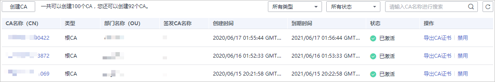
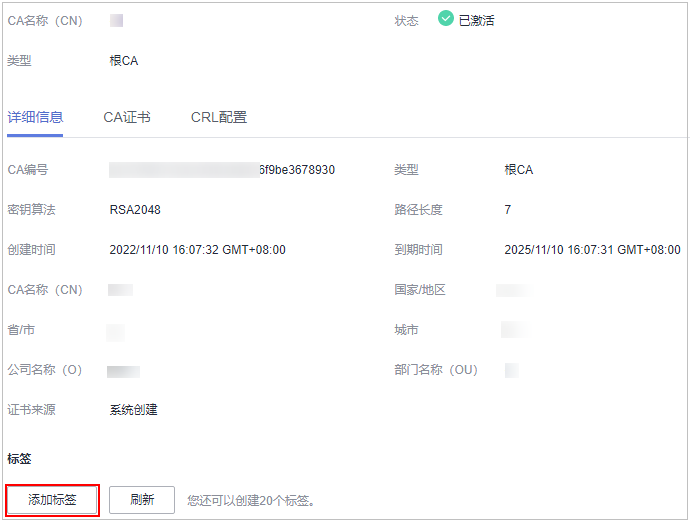

# 查看私有CA详情

本章节指导用户查看已创建私有CA的信息，包括私有CA名称、部门名称、类型和状态等。

## 前提条件

已创建私有CA，详细操作请参见[创建私有CA](创建私有CA.md)。

## 操作步骤

1.  登录[管理控制台](https://console.huaweicloud.com/)。
2.  单击页面左上方的，选择“安全与合规  \>  云证书管理服务“，并在左侧导航栏选择“私有证书管理  \>  私有CA“进入私有CA管理界面。
3.  在私有CA列表中，查看私有CA信息，如[图1](#zh-cn_topic_0000001124519795_fig1864632765513)所示，证书参数说明如[表1](#zh-cn_topic_0000001124519795_table1731752125212)所示。

    **图 1**  私有CA列表  
    

    > **说明：** 
    >-   在“所有类型“（或“所有状态“）搜索栏选择CA类型（或状态），私有CA列表界面将只显示对应类型（或状态）的CA。
    >-   在私有CA列表右上角的搜索框中输入CA名称，单击或按“Enter“，可以搜索指定的CA。

    **表 1**  CA参数说明

    
    <table><thead align="left"><tr id="zh-cn_topic_0000001124519795_row17485275216"><th class="cellrowborder" valign="top" width="23.36%" id="mcps1.2.3.1.1">
参数名称

    </th>
    <th class="cellrowborder" valign="top" width="76.64%" id="mcps1.2.3.1.2">
说明

    </th>
    </tr>
    </thead>
    <tbody><tr id="zh-cn_topic_0000001124519795_row641052195214"><td class="cellrowborder" valign="top" width="23.36%" headers="mcps1.2.3.1.1 ">
CA名称 （CN）

    </td>
    <td class="cellrowborder" valign="top" width="76.64%" headers="mcps1.2.3.1.2 ">
用户自定义的CA名称。

    </td>
    </tr>
    <tr id="zh-cn_topic_0000001124519795_row71927536541"><td class="cellrowborder" valign="top" width="23.36%" headers="mcps1.2.3.1.1 ">
类型

    </td>
    <td class="cellrowborder" valign="top" width="76.64%" headers="mcps1.2.3.1.2 ">
私有CA的类型，说明如下：

    <ul id="zh-cn_topic_0000001124519795_ul2929591558"><li>根CA：私有CA属于根CA，可用于签发其他从属CA。</li><li>从属CA：私有CA属于从属CA。</li></ul>
    </td>
    </tr>
    <tr id="zh-cn_topic_0000001124519795_row141252195216"><td class="cellrowborder" valign="top" width="23.36%" headers="mcps1.2.3.1.1 ">
部门名称 （OU）

    </td>
    <td class="cellrowborder" valign="top" width="76.64%" headers="mcps1.2.3.1.2 ">
私有CA所属的部门名称。

    </td>
    </tr>
    <tr id="zh-cn_topic_0000001124519795_row43804325553"><td class="cellrowborder" valign="top" width="23.36%" headers="mcps1.2.3.1.1 ">
签发CA名称

    </td>
    <td class="cellrowborder" valign="top" width="76.64%" headers="mcps1.2.3.1.2 ">
签发该私有CA对应CA的名称。

    </td>
    </tr>
    <tr id="zh-cn_topic_0000001124519795_row153881514185618"><td class="cellrowborder" valign="top" width="23.36%" headers="mcps1.2.3.1.1 ">
创建时间

    </td>
    <td class="cellrowborder" valign="top" width="76.64%" headers="mcps1.2.3.1.2 ">
私有CA创建的时间。

    </td>
    </tr>
    <tr id="zh-cn_topic_0000001124519795_row178769243566"><td class="cellrowborder" valign="top" width="23.36%" headers="mcps1.2.3.1.1 ">
到期时间

    </td>
    <td class="cellrowborder" valign="top" width="76.64%" headers="mcps1.2.3.1.2 ">
私有CA到期的时间。

    </td>
    </tr>
    <tr id="zh-cn_topic_0000001124519795_row034581514542"><td class="cellrowborder" valign="top" width="23.36%" headers="mcps1.2.3.1.1 ">
状态

    </td>
    <td class="cellrowborder" valign="top" width="76.64%" headers="mcps1.2.3.1.2 ">
私有CA的状态，说明如下：

    <ul id="zh-cn_topic_0000001124519795_ul39355114576"><li>待激活：私有CA处于待激活状态。</li><li>已激活：私有CA处于已激活状态。</li><li>已禁用：私有CA处于已禁用状态。</li><li>计划删除：私有CA处于计划删除状态。</li><li>已过期：私有CA处于已过期状态。</li></ul>
    </td>
    </tr>
    <tr id="zh-cn_topic_0000001124519795_row1450415155182"><td class="cellrowborder" valign="top" width="23.36%" headers="mcps1.2.3.1.1 ">
操作

    </td>
    <td class="cellrowborder" valign="top" width="76.64%" headers="mcps1.2.3.1.2 ">
用户可以在操作栏中，执行激活、启用、禁用CA等操作。

    </td>
    </tr>
    </tbody>
    </table>

4.  用户可单击私有CA名称，查看私有CA的详细信息，如[图2](#fig56195371919)所示。

    您可在CA详情页单击“添加标签“标识CA。如果您需要使用同一标签标识多种云资源，即所有服务均可在标签输入框下选择同一标签，建议在TMS中创建预定义标签。

    **图 2**  私有CA详细信息  
    

