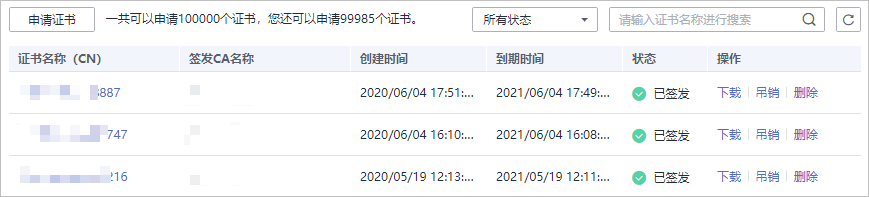
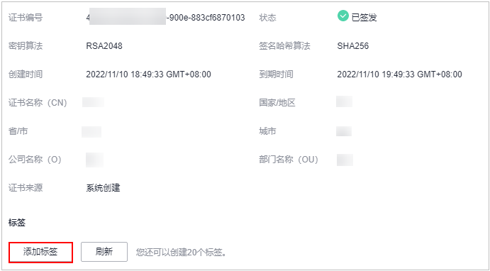

# 查看私有证书详情

该任务指导用户查看已申请私有证书的详细信息，包括私有证书名称、到期时间和状态等。

## 前提条件

已申请私有证书，详细操作请参见[申请私有证书](申请私有证书.md)。

## 操作步骤

1.  登录[管理控制台](https://console.huaweicloud.com/)。
2.  单击页面左上方的，选择“安全与合规  \>  云证书管理服务“，并在左侧导航栏选择“私有证书管理  \>  私有证书“进入私有证书管理界面。
3.  查看私有证书信息，如[图1](#zh-cn_topic_0000001124316659_fig1864632765513)所示，证书参数说明如[表1](#zh-cn_topic_0000001124316659_table1731752125212)所示。

    **图 1**  私有证书列表  
    

    > **说明：** 
    >-   在“所有状态“搜索栏选择证书状态，证书列表界面将只显示对应状态的证书。
    >-   在私有证书列表右上角的搜索框中输入证书名称，单击或按“Enter“，可以搜索指定的证书。

    **表 1**  证书参数说明

    
    <table><thead align="left"><tr id="zh-cn_topic_0000001124316659_row17485275216"><th class="cellrowborder" valign="top" width="19.98%" id="mcps1.2.3.1.1">
参数名称

    </th>
    <th class="cellrowborder" valign="top" width="80.02%" id="mcps1.2.3.1.2">
说明

    </th>
    </tr>
    </thead>
    <tbody><tr id="zh-cn_topic_0000001124316659_row641052195214"><td class="cellrowborder" valign="top" width="19.98%" headers="mcps1.2.3.1.1 ">
证书名称（CN）

    </td>
    <td class="cellrowborder" valign="top" width="80.02%" headers="mcps1.2.3.1.2 ">
申请证书时设置的私有证书名称。

    </td>
    </tr>
    <tr id="zh-cn_topic_0000001124316659_row141252195216"><td class="cellrowborder" valign="top" width="19.98%" headers="mcps1.2.3.1.1 ">
签发CA名称

    </td>
    <td class="cellrowborder" valign="top" width="80.02%" headers="mcps1.2.3.1.2 ">
签发私有证书对应私有CA的名称。

    </td>
    </tr>
    <tr id="zh-cn_topic_0000001124316659_row8582173017150"><td class="cellrowborder" valign="top" width="19.98%" headers="mcps1.2.3.1.1 ">
创建时间

    </td>
    <td class="cellrowborder" valign="top" width="80.02%" headers="mcps1.2.3.1.2 ">
私有证书创建的时间。

    </td>
    </tr>
    <tr id="zh-cn_topic_0000001124316659_row18681853135313"><td class="cellrowborder" valign="top" width="19.98%" headers="mcps1.2.3.1.1 ">
到期时间

    </td>
    <td class="cellrowborder" valign="top" width="80.02%" headers="mcps1.2.3.1.2 ">
私有证书到期的时间。

    </td>
    </tr>
    <tr id="zh-cn_topic_0000001124316659_row034581514542"><td class="cellrowborder" valign="top" width="19.98%" headers="mcps1.2.3.1.1 ">
状态

    </td>
    <td class="cellrowborder" valign="top" width="80.02%" headers="mcps1.2.3.1.2 ">
私有证书的状态，说明如下：

    <ul id="zh-cn_topic_0000001124316659_ul39355114576"><li>已签发
私有证书处于已签发状态。

    </li><li>已过期
私有证书处于已过期状态。

    </li><li>已吊销
私有证书处于已吊销状态。

    </li></ul>
    </td>
    </tr>
    <tr id="zh-cn_topic_0000001124316659_row1450415155182"><td class="cellrowborder" valign="top" width="19.98%" headers="mcps1.2.3.1.1 ">
操作

    </td>
    <td class="cellrowborder" valign="top" width="80.02%" headers="mcps1.2.3.1.2 ">
用户可以在操作栏中，执行下载、吊销和删除证书等操作。

    </td>
    </tr>
    </tbody>
    </table>

4.  用户可单击私有证书名称，查看私有证书的详细信息，如[图2](#zh-cn_topic_0000001124316659_fig14725810113147)所示。

    您可在私有证书详情页单击“添加标签“标识私有证书。如果您需要使用同一标签标识多种云资源，即所有服务均可在标签输入框下选择同一标签，建议在TMS中创建预定义标签。

    **图 2**  私有证书详细信息  
    

