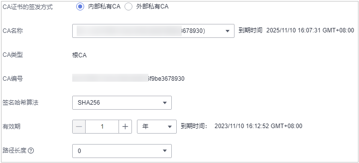
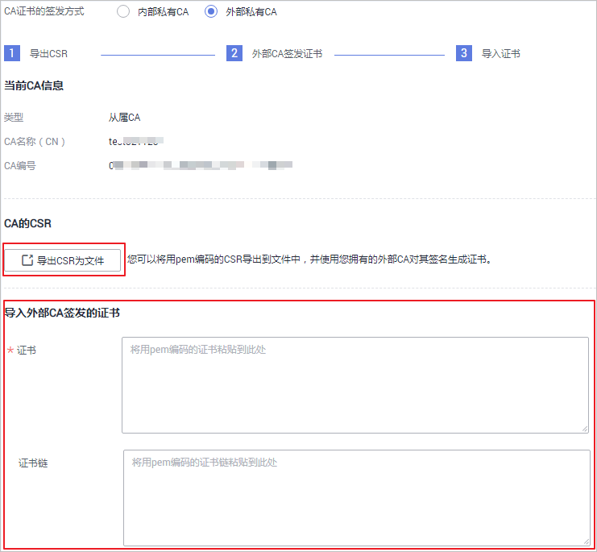

# 激活私有CA

如果您创建的私有CA为**从属CA**，则需要在创建后进行激活。激活后，才能使私有CA正式生效，并且才能可以用于签发私有证书。

本章节指导用户如何激活**从属CA**，系统提供通过内部私有CA和外部私有CA来激活私有CA两种不同的激活方式，请根据您的需要进行操作。

-   内部私有CA：使用华为云云证书管理平台已有的私有CA来激活从属CA。
-   外部私有CA：使用外部私有CA（非华为云云证书管理平台已有的私有CA）来激活从属CA。

## 前提条件

-   已创建私有从属CA，详细操作请参见[创建私有CA](创建私有CA.md)。
-   私有从属CA处于“待激活“状态。

## 使用内部私有CA激活从属CA

1.  登录[管理控制台](https://console.huaweicloud.com/)。
2.  单击页面左上方的，选择“安全与合规  \>  云证书管理服务“，并在左侧导航栏选择“私有证书管理  \>  私有CA“进入私有CA管理界面。
3.  在待激活的私有CA所在行的“操作“列，单击“激活“，系统从右面弹出激活CA详细页面，如[图1](#zh-cn_topic_0000001124316665_fig11812182113413)所示，请填写激活CA相关信息。

    **图 1**  内部私有CA  
    

    1.  选择“CA证书的签发方式“。

        此处请勾选“内部私有CA“。

    2.  配置私有CA相关参数。

        **表 1**  内部私有CA激活配置参数说明

        
        <table><thead align="left"><tr id="zh-cn_topic_0000001124316665_row99463120502"><th class="cellrowborder" valign="top" width="33.33%" id="mcps1.2.3.1.1">
参数名称

        </th>
        <th class="cellrowborder" valign="top" width="66.67%" id="mcps1.2.3.1.2">
参数说明

        </th>
        </tr>
        </thead>
        <tbody><tr id="zh-cn_topic_0000001124316665_row199477114502"><td class="cellrowborder" valign="top" width="33.33%" headers="mcps1.2.3.1.1 ">
CA名称

        </td>
        <td class="cellrowborder" valign="top" width="66.67%" headers="mcps1.2.3.1.2 ">
选择根CA或从属CA的名称。

        
选中后，系统将自动显示该CA的类型和编号。

        </td>
        </tr>
        <tr id="zh-cn_topic_0000001124316665_row994841175011"><td class="cellrowborder" valign="top" width="33.33%" headers="mcps1.2.3.1.1 ">
签名哈希算法

        </td>
        <td class="cellrowborder" valign="top" width="66.67%" headers="mcps1.2.3.1.2 ">
选择签名哈希算法：

        <ul id="zh-cn_topic_0000001124316665_ul716162091715"><li>SHA256</li><li>SHA384</li><li>SHA512</li></ul>
        </td>
        </tr>
        <tr id="zh-cn_topic_0000001124316665_row694814195018"><td class="cellrowborder" valign="top" width="33.33%" headers="mcps1.2.3.1.1 ">
有效期

        </td>
        <td class="cellrowborder" valign="top" width="66.67%" headers="mcps1.2.3.1.2 ">
选择私有CA有效期，可选择的最长有效期为20年。

        </td>
        </tr>
        <tr id="zh-cn_topic_0000001124316665_row185801629171519"><td class="cellrowborder" valign="top" width="33.33%" headers="mcps1.2.3.1.1 ">
路径长度

        </td>
        <td class="cellrowborder" valign="top" width="66.67%" headers="mcps1.2.3.1.2 ">
该从属CA的路径长度，即当前CA可以签发下级从属CA的层次数量，用于控制证书链深度。

        
 说明： 

证书链是指根CA、从属CA、私有证书三者之间通过层层信任关系链接而成的序列。

        

        </td>
        </tr>
        </tbody>
        </table>

4.  确认填写的信息无误后，单击“确定“。

## 使用外部私有CA激活从属CA

1.  登录[管理控制台](https://console.huaweicloud.com/)。
2.  单击页面左上方的，选择“安全与合规  \>  云证书管理服务“，并在左侧导航栏选择“私有证书管理  \>  私有CA“进入私有CA管理界面。
3.  在待激活的私有CA所在行的“操作“列，单击“激活“，系统从右面弹出激活CA详细页面，请填写激活CA相关信息。

    

    1.  选择“CA证书的签发方式“：此处请勾选“外部私有CA“。
    2.  导出CSR。

        在“CA的CSR“中，单击“导出CSR为文件“。

        用pem编码的CSR导出到文件中，并让一个父CA对其进行签名。

    3.  外部CA签发证书。

        使用您的私有CA签发待激活从属CA证书。

    4.  导入证书。

        在“导入外部CA签发的证书“中，将导入证书和证书链。

        **表 2**  导入证书参数说明

        
        <table><thead align="left"><tr id="zh-cn_topic_0000001124316665_row12906135142916"><th class="cellrowborder" valign="top" width="18.8%" id="mcps1.2.3.1.1">
参数

        </th>
        <th class="cellrowborder" valign="top" width="81.2%" id="mcps1.2.3.1.2">
说明

        </th>
        </tr>
        </thead>
        <tbody><tr id="zh-cn_topic_0000001124316665_row6911165182919"><td class="cellrowborder" valign="top" width="18.8%" headers="mcps1.2.3.1.1 ">
证书

        </td>
        <td class="cellrowborder" valign="top" width="81.2%" headers="mcps1.2.3.1.2 ">
导入证书体，以文本方式打开待上传证书里的PEM格式的文件（后缀名为“.pem”），将证书体复制到此处。

        </td>
        </tr>
        <tr id="zh-cn_topic_0000001124316665_row1491212517291"><td class="cellrowborder" valign="top" width="18.8%" headers="mcps1.2.3.1.1 ">
证书链

        </td>
        <td class="cellrowborder" valign="top" width="81.2%" headers="mcps1.2.3.1.2 ">
导入证书链，以文本方式打开待上传证书里的PEM格式的文件（后缀名为“.pem”），将证书链复制到此处。

        </td>
        </tr>
        </tbody>
        </table>

4.  确认填写的信息无误后，单击“确定“。

    当私有CA的状态更新为“已激活“，则表示激活私有CA成功。

## 后续处理

私有CA激活后，即可用于签发私有证书，申请私有证书详细操作请参见[申请私有证书](申请私有证书.md)。

