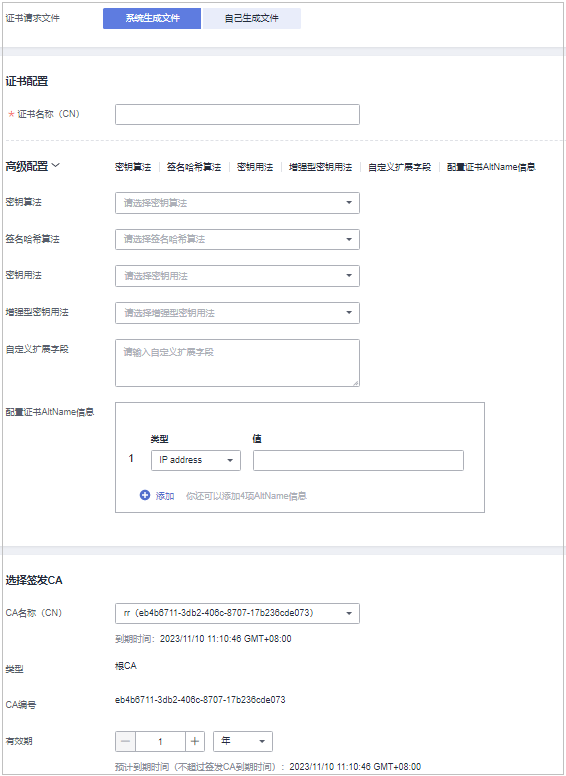
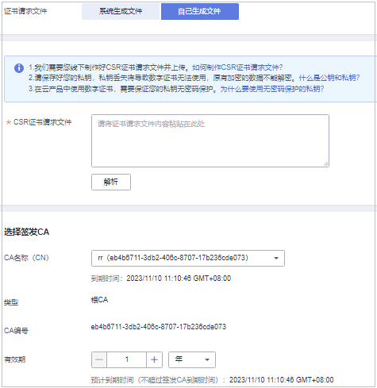

# 申请私有证书

通过云证书管理控制台创建并激活私有CA后，您就可以通过私有CA申请私有证书，用于组织内部应用的身份认证和数据加解密。

本章节介绍如何申请私有证书。每个用户可以申请100,000个证书。

## 前提条件

已创建并激活私有CA，详细操作请参见[创建私有CA](创建私有CA.md)、[激活私有CA](激活私有CA.md)。

## 操作步骤

1.  登录[管理控制台](https://console.huaweicloud.com/)。
2.  单击页面左上方的，选择“安全与合规  \>  云证书管理服务“，并在左侧导航栏选择“私有证书管理  \>  私有证书“进入私有证书管理界面。
3.  在私有证书列表的右上角，单击“申请证书“，进入申请证书界面，请填写申请证书的相关信息。

    **图 1**  申请证书-系统生成文件  
    

    **图 2**  申请证书-自己生成文件  
    

    1.  选择证书请求文件生成方式。

        **表 1**  证书请求文件

        
        <table><thead align="left"><tr id="row1815529113213"><th class="cellrowborder" valign="top" width="34.75%" id="mcps1.2.3.1.1">
参数名称

        </th>
        <th class="cellrowborder" valign="top" width="65.25%" id="mcps1.2.3.1.2">
参数说明

        </th>
        </tr>
        </thead>
        <tbody><tr id="row4155691328"><td class="cellrowborder" valign="top" width="34.75%" headers="mcps1.2.3.1.1 ">
系统生成CSR

        </td>
        <td class="cellrowborder" valign="top" width="65.25%" headers="mcps1.2.3.1.2 ">
系统将自动帮您生成证书私钥，并且您可以在证书申请成功后直接在证书管理页面下载您的证书和私钥。

        </td>
        </tr>
        <tr id="row41552943213"><td class="cellrowborder" valign="top" width="34.75%" headers="mcps1.2.3.1.1 ">
自己生成CSR

        </td>
        <td class="cellrowborder" valign="top" width="65.25%" headers="mcps1.2.3.1.2 ">
使用已有的CSR。需执行以下操作：

        <ol id="ol9778122663313"><li>手动生成CSR文件并将文件内容复制到CSR文件内容对话框中。</li><li>单击“解析”。</li></ol>
        </td>
        </tr>
        <tr id="row11155159113215"><td class="cellrowborder" colspan="2" valign="top" headers="mcps1.2.3.1.1 mcps1.2.3.1.2 ">
 说明： 
<ul id="ul1267655183210"><li>证书请求文件（Certificate Signing Request，CSR）即证书签名申请，获取证书，需要先生成CSR文件并提交给CA中心。CSR包含了公钥和标识名称（Distinguished Name），通常从Web服务器生成CSR，同时创建加解密的公钥私钥对。</li><li>建议选择“系统生成CSR”，避免出现内容不正确而导致的审核失败。</li><li>手动生成CSR文件的同时会生成私钥文件，请务必妥善保管和备份您的私钥文件。私钥和数字证书一一对应，一旦丢失了私钥您的数字证书也将不可使用。华为云系统不负责保管您的私钥，如果您的私钥丢失，您需要重新购买并替换您的数字证书。</li><li>证书服务系统对CSR文件的密钥长度有严格要求，密钥长度必须是2,048位，密钥类型必须为RSA。</li></ul>
        

        </td>
        </tr>
        </tbody>
        </table>

    2.  配置证书主题信息。

        仅当“证书请求文件“选择“系统生成文件“时，需要配置该参数。

        “证书名称（CN）“：您可以自定义申请的私有证书的名称。

    3.  单击“高级配置“右侧的，进行高级配置。

        仅当“证书请求文件“选择“系统生成文件“时，需要配置该参数。

        **表 2**  高级配置

        
        <table><thead align="left"><tr id="row15808103713410"><th class="cellrowborder" valign="top" width="31.033103310331033%" id="mcps1.2.4.1.1">
参数名称

        </th>
        <th class="cellrowborder" valign="top" width="47.45474547454745%" id="mcps1.2.4.1.2">
参数说明

        </th>
        <th class="cellrowborder" valign="top" width="21.512151215121513%" id="mcps1.2.4.1.3">
示例

        </th>
        </tr>
        </thead>
        <tbody><tr id="row980815371347"><td class="cellrowborder" valign="top" width="31.033103310331033%" headers="mcps1.2.4.1.1 ">
密钥算法

        </td>
        <td class="cellrowborder" valign="top" width="47.45474547454745%" headers="mcps1.2.4.1.2 ">
选择待申请私有证书的密钥算法和密钥的位大小。

        
可选择“RSA2048”、“RSA4096”、“EC256”、“EC384”、“SM2”。

        </td>
        <td class="cellrowborder" valign="top" width="21.512151215121513%" headers="mcps1.2.4.1.3 ">
RSA2048

        </td>
        </tr>
        <tr id="row13808183713340"><td class="cellrowborder" valign="top" width="31.033103310331033%" headers="mcps1.2.4.1.1 ">
签名哈希算法

        </td>
        <td class="cellrowborder" valign="top" width="47.45474547454745%" headers="mcps1.2.4.1.2 ">
当“密钥算法”选择“SM2”时，，待申请私有证书签名哈希算法默认为“SM3”，无需进行选择。

        
当密钥算法选择为非SM2时，选择待申请私有证书的签名哈希算法：

        
可选择“SHA256”、“SHA384”、“SHA512”。

        </td>
        <td class="cellrowborder" valign="top" width="21.512151215121513%" headers="mcps1.2.4.1.3 ">
SHA256

        </td>
        </tr>
        <tr id="row1808113719347"><td class="cellrowborder" valign="top" width="31.033103310331033%" headers="mcps1.2.4.1.1 ">
密钥用法

        </td>
        <td class="cellrowborder" valign="top" width="47.45474547454745%" headers="mcps1.2.4.1.2 ">
选择待申请证书的密钥用法，支持选择（可多选）：

        <ul id="ul2586105446"><li>digitalSignature（数字签名）</li><li>nonRepudiation（防抵赖）</li><li>keyEncipherment（密钥加密）</li><li>dataEncipherment（数据加密）</li><li>keyAgreement（密钥协议）</li><li>keyCertSign（证书签发）</li><li>cRLSign（黑名单签名）</li><li>encipherOnly（仅加密）</li><li>decipherOnly（仅解密）</li></ul>
        </td>
        <td class="cellrowborder" valign="top" width="21.512151215121513%" headers="mcps1.2.4.1.3 ">
digitalSignature

        </td>
        </tr>
        <tr id="row91708366544"><td class="cellrowborder" valign="top" width="31.033103310331033%" headers="mcps1.2.4.1.1 ">
增强型密钥用法

        </td>
        <td class="cellrowborder" valign="top" width="47.45474547454745%" headers="mcps1.2.4.1.2 ">
选择待申请证书的增强型密钥用法，支持选择（可多选）：

        <ul id="ul9205171284713"><li>服务器身份验证</li><li>客户端身份验证</li><li>代码签名</li><li>安全电子邮件</li><li>时间戳</li></ul>
        </td>
        <td class="cellrowborder" valign="top" width="21.512151215121513%" headers="mcps1.2.4.1.3 ">
服务器身份验证

        </td>
        </tr>
        <tr id="row11808143733413"><td class="cellrowborder" valign="top" width="31.033103310331033%" headers="mcps1.2.4.1.1 ">
自定义扩展字段

        </td>
        <td class="cellrowborder" valign="top" width="47.45474547454745%" headers="mcps1.2.4.1.2 ">
填写待申请是的自定义信息。

        </td>
        <td class="cellrowborder" valign="top" width="21.512151215121513%" headers="mcps1.2.4.1.3 ">
-

        </td>
        </tr>
        <tr id="row15808837103416"><td class="cellrowborder" valign="top" width="31.033103310331033%" headers="mcps1.2.4.1.1 ">
（可选）配置证书AltName信息

        </td>
        <td class="cellrowborder" valign="top" width="47.45474547454745%" headers="mcps1.2.4.1.2 ">
如果该私有证书需要应用到多个主体，可以通过证书AltName添加其他主体的信息。

        
支持配置“IP address”、“DNS”、“Email”和“URI”四种类型的AltName信息。配置不同的类型AltName信息时，需要填写对应类型的值：

        <ul id="ul201621979157"><li>IP address：填写IP地址</li><li>DNS：填写域名</li><li>Email：填写邮箱</li><li>URI：填写网络地址</li></ul>
        
最多可配置5条AltName信息。

        </td>
        <td class="cellrowborder" valign="top" width="21.512151215121513%" headers="mcps1.2.4.1.3 ">
-

        </td>
        </tr>
        </tbody>
        </table>

    4.  选择签发CA。

        **表 3**  签发CA

        
        <table><thead align="left"><tr id="row1193125316384"><th class="cellrowborder" valign="top" width="29.21%" id="mcps1.2.3.1.1">
参数名称

        </th>
        <th class="cellrowborder" valign="top" width="70.78999999999999%" id="mcps1.2.3.1.2">
参数说明

        </th>
        </tr>
        </thead>
        <tbody><tr id="row19938539387"><td class="cellrowborder" valign="top" width="29.21%" headers="mcps1.2.3.1.1 ">
CA名称（CN）

        </td>
        <td class="cellrowborder" valign="top" width="70.78999999999999%" headers="mcps1.2.3.1.2 ">
选择已创建的私有CA的名称。

        </td>
        </tr>
        <tr id="row6933537383"><td class="cellrowborder" valign="top" width="29.21%" headers="mcps1.2.3.1.1 ">
类型

        </td>
        <td class="cellrowborder" valign="top" width="70.78999999999999%" headers="mcps1.2.3.1.2 ">
选择“CA名称（CN）”后，系统将自动显示该CA的类型。

        </td>
        </tr>
        <tr id="row1593953203814"><td class="cellrowborder" valign="top" width="29.21%" headers="mcps1.2.3.1.1 ">
CA编号

        </td>
        <td class="cellrowborder" valign="top" width="70.78999999999999%" headers="mcps1.2.3.1.2 ">
选择“CA名称（CN）”后，系统将自动显示该CA的编号。

        </td>
        </tr>
        <tr id="row205231557203915"><td class="cellrowborder" valign="top" width="29.21%" headers="mcps1.2.3.1.1 ">
有效期

        </td>
        <td class="cellrowborder" valign="top" width="70.78999999999999%" headers="mcps1.2.3.1.2 ">
设置私有证书的有效期。

        
 说明： 
<ul id="ul144297111367"><li>您可以自定义私有证书有效期，该有效期不得超过当前已激活私有CA的有效期。</li><li>私有CA有效期最长为30年。</li></ul>
        

        </td>
        </tr>
        </tbody>
        </table>

    5.  （可选）在“企业项目“下拉列表中选择您所在的企业项目。

        企业项目针对企业用户使用，只有开通了企业项目的客户，或者权限为企业主帐号的客户才可见。

        如需使用该功能，请[开通企业管理功能](https://support.huaweicloud.com/usermanual-em/em_am_0008.html)。企业项目是一种云资源管理方式，企业项目管理服务提供统一的云资源按项目管理，以及项目内的资源管理、成员管理。

        > **说明：** 
        >“default“为默认企业项目，帐号下原有资源和未选择企业项目的资源均在默认企业项目内。

4.  确认信息以及价格无误后，单击“确定“。

    申请成功后，系统将返回到私有证书页面，在页面右上角弹出“申请证书xxx成功！“，则说明私有证书申请成功。

## 后续处理

私有证书签发后，就可以下载到本地，并分发给证书主体进行安装使用，详细操作请参见[下载私有证书](下载私有证书.md)。

