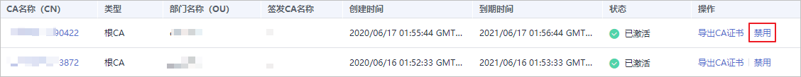
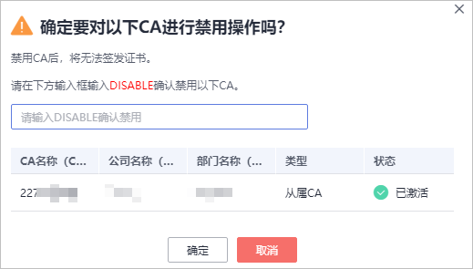

# 禁用私有CA

如果您不再需要使用某个私有CA来签发证书，可以禁用该私有CA。

私有CA被禁用后，您将不能使用该私有CA签发任何私有证书。如果要使用该私有CA进行签发私有证书操作，您需将该私有CA重新启用，具体操作请参见[启用私有CA](启用私有CA.md)。

本章节将介绍如何对指定的私有CA进行禁用。

> **注意：** 
>私有CA禁用期间也将保持收费。

## 前提条件

待禁用的私有CA需处于“已激活“或“已过期”状态。

## 操作步骤

1.  登录[管理控制台](https://console.huaweicloud.com/)。
2.  单击页面左上方的，选择“安全与合规  \>  云证书管理服务“，并在左侧导航栏选择“私有证书管理  \>  私有CA“进入私有CA管理界面。
3.  在需要禁用的私有CA所在行的“操作“列，单击“禁用“。

    

4.  在弹出的对话框中输入“DISABLE“，并单击“确定“，完成禁用私有CA操作。

    **图 1**  禁用CA提示信息  
    

    当页面右上角弹出“禁用CA xxx 成功！“，且私有CA状态更新为“已禁用“，则说明禁用私有CA操作成功。

