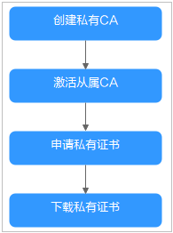

# 私有证书申请概述

私有证书管理（Private Certificate Authority，PCA）是一个私有CA和私有证书管理平台。它让用户可以通过简单的可视化操作，建立用户自己完整的CA层次体系并使用它签发证书，实现了在组织内部签发和管理自签名私有证书。主要用于对组织内部的应用身份认证和数据加解密。

私有CA颁发的证书仅在您的组织内受信任，在Internet上不受信任。如需使用在Internet上受信任的证书，请购买SSL证书，具体操作请参见[购买SSL证书](https://support.huaweicloud.com/usermanual-ccm/ccm_01_0074.html)。

私有证书申请流程如[图 私有证书申请流程](#fig11392474271)所示，流程相关说明如[表 私有证书申请流程说明](#table6651631142713)所示。

**图 1**  私有证书申请流程  

**表 1**  私有证书申请流程说明

<table><thead align="left"><tr id="row5661231172718"><th class="cellrowborder" valign="top" width="13.251325132513253%" id="mcps1.2.4.1.1">
步骤

</th>
<th class="cellrowborder" valign="top" width="21.3021302130213%" id="mcps1.2.4.1.2">
申请操作

</th>
<th class="cellrowborder" valign="top" width="65.44654465446544%" id="mcps1.2.4.1.3">
说明

</th>
</tr>
</thead>
<tbody><tr id="row6669313274"><td class="cellrowborder" valign="top" width="13.251325132513253%" headers="mcps1.2.4.1.1 ">
1

</td>
<td class="cellrowborder" valign="top" width="21.3021302130213%" headers="mcps1.2.4.1.2 ">
<a href="创建私有CA.md">创建私有CA</a>

</td>
<td class="cellrowborder" valign="top" width="65.44654465446544%" headers="mcps1.2.4.1.3 ">
根据需要创建私有CA。

首次创建私有CA时，须先创建根CA。后续可以在已有根CA下创建多个从属CA。

</td>
</tr>
<tr id="row366731132711"><td class="cellrowborder" valign="top" width="13.251325132513253%" headers="mcps1.2.4.1.1 ">
2

</td>
<td class="cellrowborder" valign="top" width="21.3021302130213%" headers="mcps1.2.4.1.2 ">
<a href="激活私有CA.md">激活私有CA</a>

</td>
<td class="cellrowborder" valign="top" width="65.44654465446544%" headers="mcps1.2.4.1.3 ">
私有<strong id="b156773113276">根CA</strong>创建后，即可用于签发私有证书。

私有<strong id="b9671315278">从属CA</strong>创建后需要激活，激活后才能使私有CA正式生效，并且用于签发私有证书。

</td>
</tr>
<tr id="row767153102713"><td class="cellrowborder" valign="top" width="13.251325132513253%" headers="mcps1.2.4.1.1 ">
3

</td>
<td class="cellrowborder" valign="top" width="21.3021302130213%" headers="mcps1.2.4.1.2 ">
<a href="申请私有证书.md">申请私有证书</a>

</td>
<td class="cellrowborder" valign="top" width="65.44654465446544%" headers="mcps1.2.4.1.3 ">
通过已激活的私有CA，申请私有证书。

</td>
</tr>
<tr id="row66723182714"><td class="cellrowborder" valign="top" width="13.251325132513253%" headers="mcps1.2.4.1.1 ">
4

</td>
<td class="cellrowborder" valign="top" width="21.3021302130213%" headers="mcps1.2.4.1.2 ">
<a href="下载私有证书.md">下载私有证书</a>

</td>
<td class="cellrowborder" valign="top" width="65.44654465446544%" headers="mcps1.2.4.1.3 ">
申请完成后，即可下载私有证书并在服务器上安装使用。

</td>
</tr>
</tbody>
</table>

