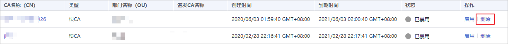
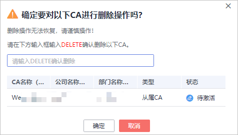
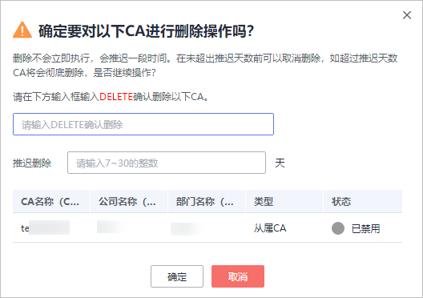

# 计划删除私有CA

在删除私有CA前，您需要确保该私有CA没有被使用且将来也不会被使用。

用户执行删除私有CA操作后，私有CA不会立即删除（待激活的私有CA将立即删除），私有证书管理服务会将该操作按用户指定时间推迟执行，推迟时间范围为7天～30天。在推迟删除时间未到时，若需要重新使用该私有CA，可以执行取消删除私有CA操作。若超过推迟时间，私有CA将被彻底删除，请谨慎操作。

> **注意：** 
>-   私有CA禁用期间也将保持收费。
>-   用户执行删除私有CA操作后，私有CA不会立即删除。计划删除最快7天生效（根据您设置的推迟时间为准）。在此期间收费情况说明如下：
>    -   如果用户未取消计划删除，私有CA被删除了，则在计划删除期间的私有CA不会收费；
>    -   如果用户在计划删除期间，取消了计划删除，私有CA未被删除，则在计划删除期间的私有CA将保持收费。
>    例如：您在2022年01月01日00:00执行了删除私有CA的操作，且设置的私有CA计划删除推迟时间为7天，7天后私有CA被删除，那么，PCA服务将不收取这7天的费用；如果您在2022年01月04日00:00取消了计划删除，私有CA未被删除，那么，PCA服务将补齐2022年01月01日00:00至2022年01月04日00:00期间的费用。

## 前提条件

待删除的私有CA需处于“已禁用“或“待激活“状态。

## 操作步骤

1.  登录[管理控制台](https://console.huaweicloud.com/)。
2.  单击页面左上方的，选择“安全与合规  \>  云证书管理服务“，并在左侧导航栏选择“私有证书管理  \>  私有CA“进入私有CA管理界面。
3.  在需要删除的私有CA所在行的“操作“列，单击“删除“。

    **图 1**  删除私有CA  
    

4.  不同状态私有CA操作不同：
    -   待激活状态私有CA

        在弹出的对话框中，输入“DELETE“。

        **图 2**  删除私有CA（待激活状态私有CA）  
        

    -   已禁用、已过期状态私有CA

        在弹出的对话框中，输入“DELETE“，并填写“推迟删除“的时间。

        **图 3**  计划删除时间（已禁用、已过期状态私有CA）  
        

5.  单击“确定“，完成删除私有CA操作。
    -   待激活状态私有CA：当页面右上角弹出“删除CA xxx 成功！“，则说明删除私有CA操作成功。
    -   已禁用、已过期状态私有CA：当私有CA状态更新为“计划删除“，则说明计划删除私有CA操作成功。

