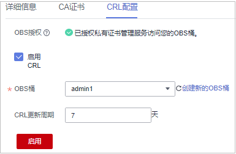

# 配置证书吊销列表

如果需要PCA为私有CA吊销的证书发布证书吊销列表（Certificate Revocation List，CRL），可以启用证书吊销列表。

本章节为您详细介绍启用或停用证书吊销列表的操作流程。

## 前提条件

待配置CRL的私有CA需处于“已激活“或“已禁用”状态

## 启用证书吊销列表

1.  登录[管理控制台](https://console.huaweicloud.com/)。
2.  单击页面左上方的，选择“安全与合规  \>  云证书管理服务“，并在左侧导航栏选择“私有证书管理  \>  私有CA“进入私有CA管理界面。
3.  单击私有CA名称，系统从右面弹出私有CA详情页面。
4.  在私有CA详情页面，选择“CRL配置“页签，配置证书吊销信息，如[图 CRL配置](#fig1935712317519)所示，参数说明如[表 证书吊销参数说明](#table927294811614)所示。

    **图 1**  CRL配置  
    

    **表 1**  证书吊销参数说明

    
    <table><thead align="left"><tr id="ccm_01_0016_zh-cn_topic_0000001124217631_row99463120502"><th class="cellrowborder" valign="top" width="33.33%" id="mcps1.2.3.1.1">
参数名称

    </th>
    <th class="cellrowborder" valign="top" width="66.67%" id="mcps1.2.3.1.2">
参数说明

    </th>
    </tr>
    </thead>
    <tbody><tr id="ccm_01_0016_zh-cn_topic_0000001124217631_row1271693910366"><td class="cellrowborder" valign="top" width="33.33%" headers="mcps1.2.3.1.1 ">
OBS授权

    </td>
    <td class="cellrowborder" valign="top" width="66.67%" headers="mcps1.2.3.1.2 ">
确认是否授权PCA服务访问您的OBS桶并上传CRL文件。

    
若确认授权，则单击“立即授权”，并根据提示完成授权。

    
授权成功后，取消授权需要到统一身份认证服务控制台委托服务列表中删除委托。

    
若已授权，则无需再次授权。

    </td>
    </tr>
    <tr id="ccm_01_0016_zh-cn_topic_0000001124217631_row199477114502"><td class="cellrowborder" valign="top" width="33.33%" headers="mcps1.2.3.1.1 ">
启用CRL发布

    </td>
    <td class="cellrowborder" valign="top" width="66.67%" headers="mcps1.2.3.1.2 ">
确认是否启用CRL发布。

    </td>
    </tr>
    <tr id="ccm_01_0016_zh-cn_topic_0000001124217631_row109471614503"><td class="cellrowborder" valign="top" width="33.33%" headers="mcps1.2.3.1.1 ">
OBS桶

    </td>
    <td class="cellrowborder" valign="top" width="66.67%" headers="mcps1.2.3.1.2 ">
选择已有的OBS桶，或单击“创建新的OBS桶”来创建新的OBS桶。

    </td>
    </tr>
    <tr id="ccm_01_0016_zh-cn_topic_0000001124217631_row694814195018"><td class="cellrowborder" valign="top" width="33.33%" headers="mcps1.2.3.1.1 ">
CRL更新周期

    </td>
    <td class="cellrowborder" valign="top" width="66.67%" headers="mcps1.2.3.1.2 ">
CRL更新的周期。私有证书管理服务将在指定时间内重新生成CRL。

    
可设置为7~30的整数更新天数，如果未设置则默认为7天。

    </td>
    </tr>
    </tbody>
    </table>

5.  单击“启用“，启用证书吊销列表，系统提示“已启用“，表示启用CRL成功。

## 停用证书吊销列表

1.  登录[管理控制台](https://console.huaweicloud.com/)。
2.  单击页面左上方的，选择“安全与合规  \>  云证书管理服务“，并在左侧导航栏选择“私有证书管理  \>  私有CA“进入私有CA管理界面。
3.  单击私有CA名称，系统从右面弹出私有CA详情页面。
4.  在私有CA详情页面，选择“CRL配置“页签，单击“停用“，系统提示“已停用“，表示停用CRL成功。

